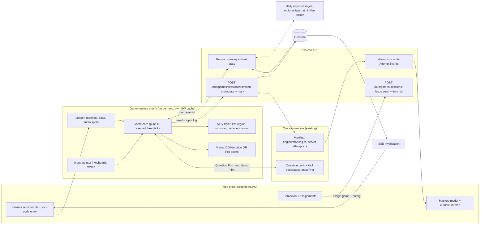

# Learning Hub Games: Tech Stack Research (02)

Date: 2026-09-26. Author: research agent. Scope: recommendation only, no app code changed. Spike files live in `scratch/games-spikes/`.

## 0. TL;DR recommendation

1. **Game runtime = PixiJS v8 (WebGL, Canvas fallback) + our own tiny deterministic game core, shipped as an isolated, on-demand chunk** (`/games/*` route group, dynamic `import()`, its own service-worker cache). Nothing from it enters the hub bundle.
2. **Most "games" should not use a canvas engine at all.** Roughly 70% of the value (sorting, matching, ordering, number-line races, word builders, memory) is DOM/CSS + `motion` (13.x, ~22 kB gz) with a11y for free. Reserve Pixi for the 30% needing many sprites, particles, physics or scrolling worlds.
3. **Games are pure functions of `(seed, inputs)`** using the existing `makeRng` (mulberry32) pattern from `features/learninghub/tools/engine/rng.ts`. The game never marks answers. It asks a **Question Port** for the next item and emits `answer` events; the server re-simulates/marks and updates mastery.
4. **Realtime classroom mode: reuse what already exists.** The board already runs on Daily.co app messages (`live/board/sync.ts`) and the app has SSE invalidation (`lib/realtime.ts`). Kahoot-style rooms are low-bandwidth (30 kids, one tap per question). Build them on **server-authoritative HTTP POST for answers + SSE/Firestore fan-out for room state**, with a Daily app-message fast path only when a live lesson is already open. Defer Colyseus/WebSocket infra until a real-time action game (per-frame shared state) is actually required.
5. **Art: procedural/vector characters driven by our existing mascot SVG rig plus a small commissioned sprite set** (Section 9). Rive is the best character-state-machine option but is a second art toolchain; adopt only if a designer is hired.
6. **Do not use Godot/Unity/PlayCanvas/Babylon/Three** for the first year (bundle, memory, a11y, i18n cost). Details below.

## 1. Constraints derived from the repo

Evidence read: `package.json`, `lib/realtime.ts`, `features/learninghub/tools/engine/rng.ts`, `live/board/sync.ts`, `DEPLOY.md`.

- Next.js **16.2.10** with React 19.2.4; `AGENTS.md` says read `node_modules/next/dist/docs/` before writing routes (dirs: `01-app`, `02-pages`, `03-architecture`, `04-community`). Any route or dynamic-import wiring in the vertical slice must be checked against those docs, not memory.
- Web on Vercel, API on an always-on Node host (Express 5 + firebase-admin). Vercel cannot host stateful WebSocket servers; the API host can.
- Server is plain Express (no `ws`/socket.io today). Realtime = one shared `EventSource` (browser limit ~6 per origin on HTTP/1.1; `lib/realtime.ts` documents this and shares one connection). A game must NOT open its own EventSource.
- Existing seeded question kind "tool" (`ToolQuestion.tsx`, `server/src/routes/hub/questions.ts`, `attempts.ts`): regenerate from seed. This is the seam for games.
- Mascot is an SVG rig (`features/learninghub/mascot`). Whiteboard is a Canvas2D op-log with 40 ms batching over Daily messages (each under ~4 KB).
- No service worker or PWA manifest found in `app`/`lib`/`public` (grep for `serviceWorker`/`manifest` returned nothing). Offline is greenfield.
- Hub is "already heavy and slow to load" (owner). Therefore hard rule: **zero game code in the hub entry chunk**.

## 2. Measured facts

### 2.1 Bundle sizes (measured)

Method: in `scratch/games-spikes`, `npm i` the latest version, then `esbuild --bundle --minify --format=esm` on a one-line entry importing the named symbols, and `gzip -9` on the output. Tree-shaking only what esbuild can do; Next/webpack/Turbopack results will be similar but not identical. Dates: npm registry queried 2026-09-26.

| Package (version, npm modified) | Entry imported | Minified | Gzip |
|---|---|---|---|
| pixi.js 8.21.0 (2026-09-25) | Application, Sprite, Graphics, Container, Text, Assets | 592 KB | **174 KB** |
| pixi.js 8.21.0 | `import *` (everything) | 917 KB | 264 KB |
| phaser 4.2.1 (2026-07-09) | `import Phaser` (whole) | 1,395 KB | **369 KB** |
| excalibur 0.32.0 | `import *` | 570 KB | 147 KB |
| kaplay 3001.0.19 | default | 189 KB | **69 KB** |
| matter-js 0.20.0 (last release 2024-06) | default | 86 KB | 28 KB |
| planck 1.5.0 | `import *` | 215 KB | 49 KB |
| @dimforge/rapier2d-compat 0.21.0 | default | 3,405 KB (wasm inlined base64) | **1,288 KB** |
| howler 2.2.4 (last release 2023-09) | Howl | 37 KB | 10 KB |
| motion 13.4.4 | `animate` | 60 KB | 22 KB |
| @rive-app/canvas-lite 2.43.1 | Rive | 179 KB JS + 885 KB `rive_fallback.wasm` (raw file size) | 50 KB JS |
| @lottiefiles/dotlottie-web 0.80.0 | DotLottie | 62 KB JS + 1,238 KB `dotlottie-player.wasm` (raw) | 14 KB JS |

Notes: the Phaser marketing claim of "~150 KB gz tree-shakeable core" (gamefromscratch, phaser.io news Apr 2026) was NOT reproduced by the naive `import Phaser`; a hand-picked import of `Phaser.Core`, Scenes and Sprite could be smaller but takes work. Pixi's 174 KB gz is for a fairly minimal import; Pixi's extension system means sub-features can be trimmed further (untested).

### 2.2 Render spike (measured, with caveats)

Method: `scratch/games-spikes/spike.mjs` runs Playwright Chromium (headless, macOS) with CDP `Emulation.setCPUThrottlingRate` 1x/4x/6x, moving N 20x20 sprites for 1.5 s and counting `requestAnimationFrame` frames. Canvas2D `drawImage` of a pre-rendered circle vs PixiJS 8.21 WebGL (`renderer.name = webgl`). Numbers are average FPS (capped by ~120 Hz display).

| CPU throttle | Canvas2D 500 | Pixi 500 | Canvas2D 3000 | Pixi 3000 |
|---|---|---|---|---|
| 1x | 121 | 105 | 119 | 31 |
| 4x | 121 | 103 | 28 | 46 |
| 6x | 101 | 103 | 19 | 33 |

Honest interpretation:
- **CPU throttling does not throttle the GPU.** Headless Chromium here very likely used software GL (SwiftShader), so Pixi's 3000-sprite numbers are pessimistic vs a real Chromebook iGPU and Canvas2D is favoured. Do not read this as "Canvas2D beats Pixi".
- Robust conclusion: at **~500 moving sprites both hold ~100 fps even at 6x CPU slowdown**. Educational games rarely need more than 200 sprites on screen. Below ~500 sprites, engine choice is not a performance question; bundle size, a11y and authoring cost dominate.
- Above ~1000 sprites Canvas2D degrades quickly under CPU throttle (28 fps at 3000/4x, 19 at 6x), so particle-heavy games need WebGL (Pixi) or must be capped.
- Follow-up needed (not done): run the same page on a real 4 GB/2 GB Chromebook and an iPad 9th gen. Budget one day in slice week 1.

## 3. Rendering options: decision matrix

Scores 1-5 (5 best) for OUR context: 2 GB Chromebooks, kids, tutor projecting, a11y, 11 locales, small team, must plug into question bank. Weighted sum uses weights in header.

| Option | Bundle (w3) | Low-end perf (w3) | A11y/i18n/text (w3) | Authoring speed (w2) | Char. animation (w2) | Fit w/ our React app (w2) | Weighted /15 pts x weights (max 80) | Verdict |
|---|---|---|---|---|---|---|---|---|
| DOM/CSS + `motion` | 5 | 3 | **5** | 5 | 3 | 5 | **70** | Default for board-like games |
| Canvas2D hand-rolled | 5 | 3 | 2 | 3 | 3 | 3 | 55 | Fine for tiny toys; we already have one in `tools/engine` and the board |
| **PixiJS 8** | 3 | 4 | 3 (HTMLText/Text; a11y plugin exists) | 3 | 4 | 3 | **57** | **Chosen for sprite games** |
| Phaser 4 | 2 | 4 | 2 | 4 (scenes, tweens, physics, input built in) | 3 | 2 | 52 | Best batteries-included; 369 KB gz + own game loop philosophy fights React |
| kaplay | 4 | 3 | 2 | 5 | 3 | 3 | 56 | Fast to prototype; 69 KB gz; smaller ecosystem/maintenance risk |
| Excalibur | 3 | 3 | 2 | 4 | 3 | 3 | 49 | TS-native, fine, but small community |
| Rive (state machines) | 3 (JS 50 KB + 885 KB wasm) | 4 | 3 | 3 (needs designer + Rive editor) | **5** | 3 | 56 | Best for reactive characters; add later for mascot |
| Lottie/dotLottie | 3 (14 KB + 1.2 MB wasm) | 4 | 3 | 4 | 3 (playback only, no logic) | 4 | 55 | Good for celebratory one-shots |
| Three.js / r3f | 1 | 2 | 1 | 2 | 3 | 3 | 33 | No: 3D not needed, RAM heavy |
| Babylon / PlayCanvas | 1 | 2 | 1 | 2 | 3 | 1 | 28 | No |
| Godot / Unity web export | 1 (Godot 4.3+ single-thread export works without COOP/COEP headers, but wasm is multi-MB; Unity worse) | 2 (RAM) | 1 | 3 | 4 | 1 | 30 | No: opaque a11y, no DOM text, RTL/i18n pain, 2 GB Chromebook risk |

Score arithmetic is subjective; the point is ordering. The weighted column sums (score x weight) so DOM/CSS tops on our constraints.

WebGPU readiness (verified via search, Sept 2026): stable in Chrome/Edge on Windows/macOS/ChromeOS, Chrome Android (121+, Android 12+), Firefox 141/145+, Safari 26 on macOS/iOS/iPadOS (web.dev, videocardz, webgpu.com). BUT school Chromebooks are often old (ChromeOS versions pinned, weak GPU drivers). Decision: **use Pixi with `preference: 'webgl'`; do not require WebGPU.** Pixi 8 also added an experimental Canvas renderer in 8.16 (Feb 2026, pixijs.com/blog/8.16.0) for no-GL environments; treat as untested fallback.

Sources: https://pixijs.com/blog , https://pixijs.com/blog/8.16.0 , https://phaser.io/news/2026/04/phaser-4-renderer-faster-cleaner-and-built-for-modern-games , https://gamefromscratch.com/phaser-4-released/ (Phaser 4 released 14 Apr 2026, 4.1 30 Apr), https://web.dev/blog/webgpu-supported-major-browsers , https://godotengine.org/article/progress-report-web-export-in-4-3/ .

## 4. Physics, audio, input

**Physics.** Most maths/literacy games need none (tweens + simple AABB). If needed: **planck (49 KB gz)** for Box2D-grade determinism-ish stacking/ramps; **matter-js (28 KB gz)** is smaller but unmaintained since 2024-06. **Rapier is out** for the runtime: 1.29 MB gz with inlined wasm (measured); only revisit lazily-loaded for a dedicated physics-lab game. Physics is not deterministic across engines/browsers reliably, so **anything scored must not depend on physics outcomes**; use physics for feel, compute the answer from the rule.

**Audio.** WebAudio via **Howler 2.2.4 (10 KB gz)** with audio sprites (one file, many cues). Note: last release 2023; fine as a thin wrapper, but a 100-line own wrapper on WebAudio is a viable replacement. Tone.js 15.1.22 (active, 5.4 MB unpacked) only for the music-theory subject, lazy-loaded. Requirements: unlock on first user gesture (iOS/Chrome autoplay), master mute persisted, every audio cue has a visual twin (deaf/quiet classroom), volume ducking under tutor speech. **TTS via `speechSynthesis`** (the hub already has `speak.tsx`); quality varies wildly on Chromebooks and per locale, so pre-generate or pre-record key prompts for the 11 locales where quality matters (e.g. early-reader phonics) and use `speechSynthesis` for everything else.

**Input.** Use **Pointer Events only** (mouse, touch, pen unify; `touch-action: none` on the play area; handle `pointercancel`). Keyboard is first-class (Tab/Arrows/Enter/Space) and required for a11y; a "switch access" mode = single-button scanning through focusable targets (auto-scan timer setting) reuses the same focus model. Gamepad API optional, skip for v1. Design targets: 48 px minimum hit areas, no hover-only affordances, no long press, no two-finger gestures (school iPads have shared, sticky-finger use).

## 5. Architecture

### 5.1 Principles
1. **Engine/question separation.** A game is a *presentation + mechanic* for items supplied by the question bank. The game never owns content or marks.
2. **Deterministic core.** `simulate(seed, config, inputLog) -> result`. Runs in the browser for play and on the server for verification. Reuse `makeRng(seed)`. No `Math.random`, no `Date.now()` in core; time is `tick` counter at fixed 60 Hz step; rendering interpolates.
3. **Server-authoritative scoring.** Client sends `{gameId, version, seed, inputLog (compact), clientScore}`. Server re-simulates the same pure TypeScript core (shared package, imported by both `features/games/core` and `server/src/...`; the server is ESM + tsx so shared TS is easy) and marks each embedded question against the bank. Mismatch beyond tolerance = flag, discard XP, do not accuse the child. Cheating value is low (stickers), so verify a sampled 100% of ranked/class-leaderboard runs and 10% of solo runs.
4. **Mastery events, not scores.** The mastery model consumes per-question `AttemptEvent`s, identical in shape to quiz attempts, tagged `source: "game"`. Game score never affects mastery; only correct/incorrect + latency + hints.
5. **Isolation.** Game runtime in a separate route group and dynamic import; communicates with the hub only through a typed `postMessage`-like port object (in-process, not iframe) so it can be moved to an iframe later for third-party/community games.

### 5.2 Diagram (mermaid)



### 5.3 Contracts (sketch)

```ts
// Question Port: the ONLY way a game touches content
interface QuestionPort {
  next(ctx: {difficulty: number; skillIds: string[]}): Promise<GameItem>; // prompt, choices/tool spec, itemId, seed
  submit(itemId: string, response: unknown, ms: number): void;  // queued; server marks
}
interface GameModule {
  id: string; version: number; locales: string[];
  init(opts: {seed: number; port: QuestionPort; a11y: A11yPrefs; mount: HTMLElement}): GameHandle;
}
```

ECS: not recommended for v1. Educational games have tens of entities; plain typed state + reducers (matches the whiteboard's `reducer.ts` style and the repo's existing `*.selftest.ts` pattern) is easier to test and replay. Revisit if a game exceeds ~500 live entities.

Testing: every game core ships `*.selftest.ts` (repo convention) asserting `simulate` is bit-identical across two runs and against a golden log.

## 6. Realtime for classrooms (30 kids, flaky wifi)

Traffic model: Kahoot/Blooket style is **turn-based**: one small answer per child per question (~200 bytes), plus one broadcast state per phase change. 30 kids x 1 msg/10 s = 3 msg/s. This is trivial and does not need a game server.

| Option | Fit | Pros | Cons for us |
|---|---|---|---|
| **Existing HTTP POST + Firestore + SSE (`lib/realtime.ts`)** | High | No new infra; auth/tenancy/roles already server-side; survives reconnect (state is in DB); one shared EventSource | SSE is invalidation-only, so clients refetch (adds RTT); Firestore full-collection listener cost noted in `realtime.ts`; ~1-2 s latency, fine for quizzes, poor for action games |
| **Daily app messages (already used by board)** | Medium-high inside a live lesson | Zero extra infra when tutor + kids already in a Daily room; sender identity from signed token (already solved in `sync.ts`) | Only exists in live-lesson context, not at-home/classroom-without-video; message size ~4 KB cap; not durable |
| `ws` 8.22.0 on the Express host | Medium | Tiny, we control it; sticky sessions not needed for one instance | We build rooms, reconnect, backpressure ourselves; single instance = restart drops rooms |
| **Colyseus 0.18** (released 20 Aug 2026 per colyseus.io/releases; `colyseus` 0.18.8, `@colyseus/core` 0.18.17, active) | High *if* action/real-time shared-state games arrive | Rooms, matchmaking, delta state sync, reconnection, uWS transport, client prediction built in; MIT | New stateful service to host (must be always-on, not on Vercel); scale-out needs Redis presence/driver; extra ops burden |
| PartyKit (npm 0.0.115, last publish 2025-09) | Low | Simple per-room server on Cloudflare | Version stagnant on npm; moving vendor story (Cloudflare acquired); data-residency for UK/EU child data must be checked |
| Liveblocks | Low | Managed presence | Paid per MAU; children's data processor DPA; overkill for turn-based |
| Firebase Realtime DB | Medium | Presence + low latency, already in Firebase family | A second data store with separate rules; the repo rule is "browser never touches Firestore directly; all authorization is server-side" (AGENTS.md), so a client-SDK RTDB path would break that rule |

**Recommendation:**
- v1 rooms: `Room` doc `{code, hostId, phase, questionIndex, deadline, teams}` + `Answer` subcollection; API endpoints create/join/answer/advance; SSE `useRealtime(["gameRooms"])` triggers refetch; host screen polls-through-SSE. Server stamps `deadline` and accepts answers only before it (server clock is truth, so flaky client clocks don't matter). Join code = 5-6 chars from an unambiguous alphabet (no 0/O/1/I), rate-limited, expires with the session.
- Flaky wifi: idempotent answer POST keyed by `(roomId, playerId, qIndex)`; client keeps a local outbox with retry and shows "saved" tick; on reconnect fetch full room state (no dependence on missed events); keep a 3 s grace after deadline for late-arriving-but-timestamped answers only if the client attests `answeredAt` within the window (tolerant, logged).
- Team modes: teams are server-assigned; team score = sum computed server-side.
- Move to Colyseus only when a game needs sub-second shared state (e.g. shared race track with live positions). Decision gate documented in risks.
- Load/scale: `server/src/hubLoadTest.ts` exists; extend with a 30-simulated-player room script before launch. Not measured in this research.

## 7. Offline-first / PWA for schools

No existing SW. Plan a **scoped service worker for `/games/`** only (not the whole app) so a bug cannot brick the hub:
- Precache: game runtime chunk, atlases, audio sprite, fonts; runtime-cache the question pack for the assigned unit (e.g. 20 questions x variants, or generator specs + seeds, which are tiny).
- Offline solo play with a local outbox syncing `finish` payloads later; server re-simulates, so late upload is safe. Class rooms require connectivity (say so clearly in UI).
- Add `manifest.webmanifest` (installable on Chromebook/iPad home screen). Keep the cache versioned by game `version` and hard-bounded (e.g. 25 MB) since school devices are storage-poor.
- iOS caveat: Safari can evict site storage after ~7 days of non-use unless installed to home screen. Treat cache as best-effort.
- Next 16 note: check `node_modules/next/dist/docs/01-app` for the current PWA/service-worker guidance before implementing.

## 8. Assets, loading, and performance budget

**Pipeline:** one atlas per game (TexturePacker-free option: `free-tex-packer-core` or Pixi's `assetpack`), sprites as WebP (lossy q80, alpha) with AVIF optional; characters as SVG rasterised at build to atlas at 2 sizes; audio sprite as `.m4a`(AAC, Safari) + `.webm/opus`; Basis/KTX2 GPU textures only if profiling shows texture-memory pressure (adds a transcoder wasm ~ hundreds KB; not for v1). Bitmap fonts for numeric HUD; use DOM overlay for readable text (best i18n/RTL and a11y).

**Loading rules:** the launcher tile is a static poster image (under 15 KB); runtime is fetched on first tap with a progress bar in the mascot's voice; prefetch on idle only when on unmetered connection (`navigator.connection.saveData` false); `import()` per game module so Game B's code is never fetched for Game A.

**Budget (proposed; enforce in CI):**

| Item | Budget |
|---|---|
| Hub entry chunk delta from games | **0 KB** (launcher tile <= 3 KB gz) |
| Shared game runtime (Pixi subset + core + loader + audio) | <= 260 KB gz (Pixi measured 174 KB gz + howler 10 + motion 22 shared + core ~20) |
| Per-game code | <= 60 KB gz |
| Per-game art+audio first-play payload | <= 1.5 MB; hard cap 3 MB |
| DOM/motion-only game total | <= 90 KB gz |
| Time to interactive on 4x-throttled CPU, Slow-4G profile | <= 4 s runtime, <= 2 s for second game |
| Steady-state JS heap (2 GB Chromebook) | <= 150 MB, texture memory <= 64 MB; max 2048x2048 atlas |
| Frame rate | 60 fps target, floor 30 fps at 6x CPU throttle with 200 sprites |
| Auto quality | If p95 frame >= 34 ms for 2 s: drop particles, then resolution to 0.75, then show "lite mode" |

**How to test (to implement in slice week 1):** (a) Playwright + CDP `Emulation.setCPUThrottlingRate` (4x, 6x) and `Network.emulateNetworkConditions` (Slow 4G) in a new e2e spec, capturing rAF frame times through `page.evaluate` like `scratch/games-spikes/spike.mjs`; (b) Lighthouse CI on `/games/<id>` with mobile preset (already simulates 4x CPU); (c) `performance.measureUserAgentSpecificMemory()` / `performance.memory` in Chromium for heap; (d) manual smoke on one real 2 GB Chromebook (buy/borrow one: the single most valuable test) and an iPad 9th gen; (e) headless GL is software-rendered, so GPU-bound claims need real hardware. Follow the repo e2e rule: assertions anchored to this run's entities.

## 9. Accessibility, i18n, art

**A11y patterns for canvas:** prefer DOM for anything a child must read or choose. For Pixi scenes: keep an **invisible parallel DOM** (buttons/`role="list"`) mirroring interactive targets (Pixi's own accessibility plugin does this; verify its focus behaviour), a polite `aria-live` region announcing state ("Correct! 3 in a row", "Question 4 of 10"), visible focus ring drawn in canvas AND real focus on the DOM twin, `prefers-reduced-motion` => no screen shake/parallax/particles, fewer tweens (still show state changes), `prefers-contrast`/forced-colors => high-contrast palette with outlines, never colour-only feedback (shape + icon + sound), timers optional (an "extra time" setting per child, mandatory for SEND), pause always available, no flashing above 3 per second. Target WCAG 2.2 AA; games with mandatory time pressure are a documented exception unless timer can be disabled.

**i18n (11 locales, incl. RTL ur/ar):** all text as DOM overlay (or Pixi `HTMLText`/canvas text with a shaped font) so Arabic/Urdu shaping and bidi work; do NOT use bitmap fonts for Arabic/Urdu (joining, Nastaliq is complex, Noto Nastaliq is large; lazy-load per locale). Mirror layouts with logical coordinates (`dir=rtl` => flip x for HUD, not for number lines or maths notation, which stay LTR, and not for clocks). Never bake text into art. Numbers: use `Intl.NumberFormat` but keep the maths-notation digits per curriculum decision. Reuse existing `boardI18n.ts` pattern for the string tables. Budget: a font subset per locale <= 150 KB.

**Art options:**

| Route | Cost | Consistency with penguin mascot | Licence/IP risk | Verdict |
|---|---|---|---|---|
| Commission illustrator, one style guide + sprite kit | High, slow | Best | Clean (work-for-hire contract, assignment in writing) | Do for the hero characters + 1 world kit |
| Procedural/vector (SVG shapes, palette from CSS variables, our mascot rig) | Low | High for mascot; abstract elsewhere | None | **Default for v1 slice**; matches "never hardcode colours" |
| Generative AI then cleaned | Low | Drifts; needs heavy cleanup | Unclear copyright ownership, training-data disputes, some school procurement policies forbid | Only for mood boards/placeholders, never shipped assets, unless legal signs off |
| Stock/CC0 packs (Kenney, etc.) | Free | Poor | CC0 is safe; verify each pack | Fine for SFX/placeholder shapes |

Keep an `ASSETS.md` provenance ledger (source, licence, author, date) per file, checked in CI. Music/SFX: CC0 or commissioned; avoid "royalty-free" that forbids redistribution inside an app.

## 10. Analytics events (mastery-oriented)

Server-side, batched, no PII beyond child id already in the model. Events (all carry `gameId, gameVersion, sessionId, roomId?, seed, locale, device class`):
`game_open`, `game_load_ms`, `session_start`, `item_shown {itemId, skillIds, difficulty}`, `item_answered {correct, ms, hintCount, attempt#}`, `hint_used`, `session_pause`, `session_finish {items, correct, xp}`, `quality_downgrade {reason}` (perf), `error {code}`, `room_join/leave/late_answer`. Mastery consumes only `item_answered`. Use the events also to detect "gaming the system" (rapid random answers under 600 ms, always-first-choice) and downweight mastery evidence. Respect the hub's existing consent/DPA (there is `public/dpa.html`); no third-party analytics SDKs in a children's context.

## 11. Recommended stack (final)

| Layer | Choice | Why | Trade-off |
|---|---|---|---|
| UI-style games | React + `motion` 13 | 22 KB gz, a11y/i18n free, fits React 19 | Not for 500+ sprites |
| Sprite games | PixiJS 8.21 (WebGL; Canvas fallback experimental) | Actively released weekly, 174 KB gz measured, fast on low-end at 500 sprites, mature filters/text | No scene/physics/tween batteries: we write ~1.5k lines of glue; use `motion`'s `animate` or a small tween util |
| Game logic | Pure TS core + `makeRng` + fixed tick | Server re-simulation, tests, replay, no cheating incentive | Discipline; no free physics determinism |
| Physics | none by default; planck lazily | Keep budget | Physics-y games cost more |
| Audio | Howler (or own 100-line wrapper) + audio sprites + speechSynthesis | 10 KB gz | Howler unmaintained since 2023 |
| Characters | Existing mascot SVG rig -> baked to atlas; Rive later | Consistent, zero new toolchain | Less expressive than Rive |
| Realtime | HTTP + Firestore + SSE now; Daily messages optionally; Colyseus 0.18 gate later | No new infra, tenancy already enforced | Not for per-frame shared state |
| Offline | Scoped SW for `/games/` | Blast-radius contained | iOS eviction |
| Loading | Route group + dynamic import + budget CI | Hub stays light | Two bundles to reason about |

Explicitly rejected: Phaser 4 as the default (369 KB gz whole-import, owns the loop and input, weaker React/a11y fit) although it is the right pick if the team later wants more built-in scene/physics tooling; kaplay is the "speed prototype" alternative (69 KB gz) but with less mature text/i18n and a thinner maintainer base.

## 12. First vertical slice (about 2 weeks, one developer + part-time designer)

**Game:** "Penguin Number Dash" (KS1/KS2 maths facts and number sense): penguin slides along an ice track; each gate poses a seeded question from the existing `tool`/number-line generators; tap/keyboard picks the lane. Sprite-light (fits Pixi with ~100 sprites), plus a DOM overlay for the question text. Solo at home and a class-room mode (host screen shows the leaderboard).

| Day | Milestone | Exit criteria |
|---|---|---|
| 1-2 | Spike-to-spec: read Next 16 docs for route groups/dynamic imports; `/games` route group; runtime loader; Pixi 'hello' at Chromebook budget; CI size gate | Runtime chunk <= 260 KB gz; hub entry unchanged (verified with build output diff) |
| 3-4 | Game core (pure TS): seeded track, tick loop, input log, `simulate()`, selftests (determinism, golden replay) | `*.selftest.ts` green; same result twice; shared import compiles in `server/` |
| 5 | Question Port bound to existing question bank/tool generators; server `sessions` + `finish` endpoints re-simulate + write `AttemptEvent`s (`source:"game"`) | Attempts appear in mastery view for the test child; tampered log rejected |
| 6-7 | View: Pixi scene, mascot sprites baked to atlas, audio sprite, DOM overlay for text, pointer + keyboard + switch scan | Playable on phone, iPad, keyboard-only |
| 8 | A11y and i18n pass: live region, focus twin, reduced-motion, high-contrast, RTL (ar/ur) screenshot review, timer-off option | axe run clean; RTL screenshots reviewed; no text baked into art |
| 9 | Perf pass on a real 2 GB Chromebook + iPad; auto-quality ladder; Playwright CPU-throttle spec | >= 30 fps at 6x throttle; heap <= 150 MB |
| 10 | Homework integration: assign game with skills/difficulty; results in homework/mastery | Tutor assigns, child plays, marked result shows |
| 11-12 | Classroom room mode: create/join by code, host screen, per-question deadline, team mode, SSE fan-out, offline outbox | Playwright two-window e2e with 30 simulated players (extend `hubLoadTest`); flaky-network e2e (offline toggle mid-question) |
| 13 | Offline: scoped SW, manifest, outbox sync | Airplane-mode solo play then sync |
| 14 | Hardening, analytics events, provenance ledger, playtest with 5-8 real children and one teacher; go/no-go review | Playtest notes; budget CI green |

Definition of done follows AGENTS.md: `npx tsc --noEmit`, `npm run build` clean, a new Playwright spec, no hardcoded colours (CSS variables), no browser Firestore access, business logic server-side.

## 13. Risk list

| # | Risk | Likelihood / impact | Mitigation |
|---|---|---|---|
| 1 | Game code leaks into hub bundle, worsening load | Med / High | Route group + dynamic import + CI size gate on entry chunk |
| 2 | 2 GB Chromebook OOM/jank | High / High | Budgets, auto-quality ladder, atlas cap 2048, real-device test in week 1-2 |
| 3 | Headless perf numbers misleading (software GL, CPU-only throttle; only measured here) | High / Med | Real device tests; treat spike as relative only |
| 4 | Non-deterministic sim between client and server breaks verification | Med / Med | Integer/fixed-point where possible, no physics in scoring, golden-replay selftests in CI |
| 5 | Cheating (fake score POSTs) | Low-Med / Low | Server re-simulation and question marking server-side; XP only from server |
| 6 | Flaky school wifi during live class | High / High | Idempotent outbox, server-clock deadlines, full-state resync, no dependence on missed events |
| 7 | SSE connection limits (6 per origin on HTTP/1.1) starve fetches | Med / High | Use the shared `lib/realtime.ts` connection only; HTTP/2 on API host |
| 8 | Scope creep to a second stack (Colyseus, Rive, Unity) | High / Med | Written decision gate: add only when a shipped game demonstrably needs it |
| 9 | Vendor/maintenance: howler stale since 2023, matter-js since 2024, PartyKit stale | Med / Low | Thin wrappers; prefer own WebAudio; avoid PartyKit |
| 10 | Arabic/Urdu shaping/RTL bugs in canvas | Med / Med | DOM text overlays; per-locale font subset; RTL screenshot review in slice |
| 11 | Children's data/privacy (rooms with names, analytics) | Med / High | No third-party SDKs; nicknames from server-approved lists; retention on room docs; DPA review before Liveblocks/Colyseus Cloud or any new processor |
| 12 | Art IP / AI-generated asset ownership | Med / High | Provenance ledger; commissioned hero art; no shipped unlicensed/AI-uncleared assets |
| 13 | Service worker bug bricks cached app | Low-Med / High | Scope to `/games/`, kill-switch endpoint, versioned caches |
| 14 | Autoplay/audio unlock on iOS/Chrome | High / Low | Unlock on first tap; visual cues always accompany audio |
| 15 | Next 16 breaking changes vs my assumptions (dynamic import, route groups, headers) | Med / Med | Read `node_modules/next/dist/docs/01-app` first (AGENTS.md rule) |
| 16 | Pixi major version churn (weekly 8.x releases) | Med / Low | Pin exact version; upgrade on a cadence |

## 14. Open questions for the owner

1. Do you already have Chromebook models in target schools (RAM/ChromeOS age)? Lets us set the floor exactly.
2. Is any game expected to need per-frame shared state (co-op racing)? That triggers the Colyseus decision.
3. Budget for a commissioned illustrator, or procedural-only for the first quarter?
4. Are competitive leaderboards (child names) acceptable to your schools' safeguarding policy, or team/anonymous only?

## Sources

- PixiJS releases and blog: https://pixijs.com/blog , https://github.com/pixijs/pixijs/releases , https://pixijs.com/blog/8.16.0 (v8.16 Feb 2026 canvas renderer), https://pixijs.com/blog/june-2026 (v8.20.1 latest per search; npm shows 8.21.0 on 2026-09-25)
- Phaser 4: https://gamefromscratch.com/phaser-4-released/ , https://phaser.io/news/2026/04/phaser-4-renderer-faster-cleaner-and-built-for-modern-games , https://www.npmjs.com/package/phaser (npm 4.2.1)
- Colyseus 0.18: https://colyseus.io/ , https://github.com/colyseus/colyseus/releases , https://docs.colyseus.io/server/transport/uwebsockets
- Liveblocks/PartyKit comparison: https://www.pkgpulse.com/guides/liveblocks-vs-partykit-vs-hocuspocus-realtime-2026 , https://app.cinevva.com/guides/multiplayer-browser-game
- WebGPU: https://web.dev/blog/webgpu-supported-major-browsers , https://www.webgpu.com/news/webgpu-hits-critical-mass-all-major-browsers/
- Godot web export: https://godotengine.org/article/progress-report-web-export-in-4-3/ , https://www.rafa.ee/articles/deploying-godot-4-html-exports/
- Package versions: `npm view <pkg> version time.modified`, run 2026-09-26.
- Repo evidence: `lib/realtime.ts`, `features/learninghub/tools/engine/rng.ts`, `features/learninghub/live/board/sync.ts`, `server/package.json`, `DEPLOY.md`, `AGENTS.md`.

Not verified by this research: real-Chromebook FPS, Pixi trimmed-import size below 174 KB gz, Pixi accessibility plugin behaviour, current market share of school Chromebook hardware, Colyseus Cloud pricing beyond the search snippet ($15/mo).
