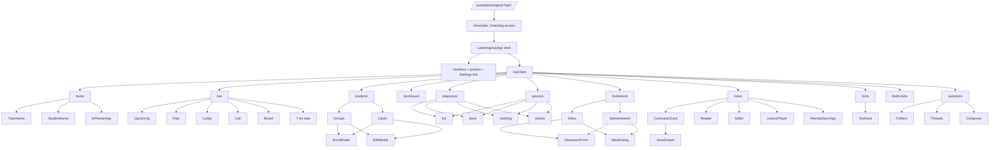

# 01 — Teaching Hub inventory (code-derived, 24 Sep 2026)

`LH/` = `features/learninghub/`. Everything here is from reading the code (no live run); word/chip/colour counts elsewhere are estimates.

## Summary
- **One component, many portals.** `LearningHubApp` (LH/LearningHubApp.tsx:38) is mounted by `lib/view-registry.tsx` for company (:129), franchise (:194), freelancer (:245) and staff (:290) as the tutor hub, and for custdash (:325) as the family hub. Only `freelancer` and `company` also register the Setup screen. Platform (HQ) has no learninghub view — HQ reaches it via "view as".
- **Tabs.** `TAB_ORDER` has 11 (panels.tsx:31). Tutor and view-only staff see 11, a parent sees 10 (no Students), a child in kid mode sees 7 (`KID_TABS`, family/KidMode.tsx:15).
- **Screens.** ~11 top-level panels + 4 Placement sub-tabs + 4 Quizzes sub-tabs (Question bank is shared) + Live lessons Upcoming/Past + Homework Inbox/Set homework + 2 filter rows on Students.

## Routes and roles
- Tutor: `/freelancer/learninghub`, `/company/learninghub`, `/franchise/learninghub`; staff `/staff/learninghub` (view-only; default access `none`, lib/accessMap.ts:255). Nav label "Teaching Hub" (lib/nav/config.ts:55,195,310,477).
- Family: `/custdash/learninghub` (label "My Classroom", nav config:508); `?child=` picks the child; `?invite=` shows FamilyInviteClaim instead of the hub (LearningHubApp.tsx:140).
- All routes take `?tab=<key>` (:43,:103). Keys: home, live, students, dashboard (label "Progress"), diagnostic (label "Placement test" / kid "Starting quiz"), quizzes, homework, notes (label "Lessons"), tools, flashcards, questions (label "Student message centre" / family "Messages").
- Deeper params from family/link.ts (open lesson / quiz / homework).
- HQ "view as": ImpersonationBar (components/shell/ImpersonationBar.tsx:28) swaps identity via `aos:actas`; the hub renders as that account's portal, with no HQ-specific code — **real-data writes**.
- Kid mode is not a route: sessionStorage `aos.hub.kid` (KidMode.tsx:12); hub root becomes `fixed inset-0`; exit via ParentGate (family/ParentGate.tsx).

## Sitemap

## Tab visibility
| tab | tutor / owner | staff (view) | parent | kid |
|---|---|---|---|---|
| Home | Y | Y | Y | Y |
| Live lessons | Y | Y | Y | N |
| Students | Y | Y | N | N |
| Progress | Y | Y | Y | N |
| Placement ("Starting quiz" for kid) | Y | Y | Y | Y |
| Quizzes | Y | Y | Y | Y |
| Homework | Y | Y | Y | Y |
| Lessons | Y | Y | Y | Y |
| Tools | Y | Y | Y | N |
| Flashcards | Y | Y | Y | Y |
| Student message centre ("Messages") | Y | Y | Y | Y |

Staff see the same tabs with write controls hidden (`readOnly`, LearningHubApp.tsx:59) plus a "View only" banner (:238).

## Sub-tabs, modals, drawers
- **Live lessons:** Upcoming/Past (LiveLessonsPanel.tsx:241); Lobby full-screen focus mode + inline call; LessonForm, edit/cancel confirm, TeachInPersonButton (:187); workspace (live/workspace/tabs.ts) has 7 tabs: Students, Lessons, Progress, Homework, Quiz, Cards, Board (family gets 4).
- **Students:** filters All/Active/Paused (+ Needs attention when relevant, StudentsPanel.tsx:412); search only above 5 students; ScopeToggle for multi-tutor tenants; GroupsSection + group dialog; EnrolModal; details modal (`#hub-subjects-modal`, :526); RowMenu (Edit, Pause, Un-enrol).
- **Progress:** CurriculumRings, Overview, per-student ProgressView; tutors can "Recalculate".
- **Placement and Quizzes:** both have 4 sub-tabs List / Question bank / Marking / Results (identical Question bank, quiz/TutorAssess.tsx:63). List has subject + year chips, preview + delete modals. Placement adds PlacementGuide and WaiveCard.
- **Homework:** Inbox / "Set homework" segmented control (TutorHomework.tsx:126); HomeworkForm (`#hub-homework-form`), MarkDialog, hand-in filters.
- **Lessons:** CurriculumCard (Curriculum toggle + subject tablist) → AreaDrawer (year filter, Move-lesson); Reader, Editor, LessonPlayer, RemoteSyncApp, FlashcardsForLesson, HomeworkForLesson.
- **Tools:** search + subject chips + key-stage chips (tools/ToolsPanel.tsx) → ToolHost dialog.
- **Flashcards:** card + bulk dialogs, ReviewSession.
- **Messages:** folders by child → lesson → thread; tutor composer; unread dots.

## Empty / error / loading states
- Shell: skeleton while providers load (:142); "hub off" empty state (:154); "We can't reach Teaching Hub right now" + Try again (:158); ErrorBanner (:236).
- Per-tab skeletons (SkeletonRows :190, CardGridSkeleton). Empty states: Students "No students enrolled yet"; Homework "Set your first homework"; Live "Schedule your first live lesson"; Lessons "Start with a topic"; Quizzes/Placement "No quizzes yet"; Flashcards "Add a topic first"; Messages "No messages yet"; child "Choose a child". Home has PartError with retry.

## Duplicate paths (assign homework and neighbours)
Shared flow (SF) = `setHubIntent` → HomeworkForm dialog.
| entry | file:line | flow |
|---|---|---|
| Home "Assign homework" | home/TutorHome.tsx:50,:56,:179 | SF |
| Home nudge row | home/ClassSnapshot.tsx:163 | SF, **no student preselect** |
| Home Attention "Overdue"/"to mark" | TutorHome.tsx:167-168 | tab jump only |
| Student card "Set homework" | StudentsPanel.tsx:378,:504 | SF |
| Progress detail | ProgressPanel.tsx:45 | SF |
| Group tile main / "+" | GroupsSection.tsx:197 | SF |
| Lesson list icon "Set for children" | NotesPanel.tsx:279,:704 | SF |
| Lesson reader | NotesPanel.tsx:596 | SF |
| Worksheet | lesson/LessonTutorPanel.tsx:46 | SF |
| Quiz card | quiz/AssessmentList.tsx:95-97,:314 | SF |
| In-person follow-up | inperson/InPersonApp.tsx:162 | SF |
| Homework tab button | homework/TutorHomework.tsx:104 | opens the form directly |
| Live workspace | live/workspace/HomeworkTab.tsx:77, QuizTab.tsx:61-73 | HomeworkForm directly |
| Inline mini-form in lesson | lesson/HomeworkForLesson.tsx:80,:108 (used NotesPanel:619, RemoteSyncApp:340) | **separate direct post** |
| In-person `sendToPortals` | inperson/api.ts:48 | **separate direct post** |

Other duplicated actions: **Enrol** (Home quick action `kind:"enrol"`, Students button :431, empty state); **Message student** (card :377 and Messages "New message"); **Start a live class** (Live tab :188; Lessons StartRemoteSyncButton NotesPanel:559; Home "Teach in person"); **New lesson** (Home and Lessons); **New quiz** (Home and Quizzes); **Curriculum** (CurriculumRings on Progress and CurriculumCard on Lessons); **Progress** (student card and Home "Top improvers"); **Marking** (Home Attention via `marking` intent and Quizzes Marking sub-tab).

## Settings and how the hub reads them
- Live in Setup → "Teaching Hub" tab (features/setup/SetupApp.tsx:1419, panel :2513), shown only if the learninghub feature is on (opt-in, lib/accessMap.ts:50). Sections: Marking & progress (pass mark, require placement, show right answers, retakes, break after not passing, homework due days), Attainment levels, Year groups, Subject colours, Question types. Some editors also reachable in the hub (subject colours, year groups, topics via TopicFilter).
- There is **no Settings tab**: a hero button (LH/HubHero.tsx:71) → `/{portal}/setup?tab=hub&from=learninghub`; staff never get it (OPERATOR_PORTALS excludes staff).
- Read by `useHubData.refresh` (LH/useHubData.ts:107-128): `GET /api/learning-hub/config` merged with `mergeHub` over HUB_DEFAULTS; passed to panels as `config`. Refetch only on shell `refresh` (hubTopics/hubEnrolments realtime, provider/child change, tab focus after 30 s `REFETCH_AFTER_MS`). No config-specific realtime event.

## Broadcasting banner
- Tutor: TutorLiveBanner (remotesync/TutorLiveBanner.tsx) polls `GET /remote-sync/sessions?status=live` every 15 s (:8) + `hubLessons` realtime; mounted in TutorHome:151 and NotesPanel:644 (NotesPanel stays mounted hidden on every tab → two pollers). Shows `live[0]`, "N of M connected" (:29).
- Family: JoinRemoteSyncBanner polls `/remote-sync/active` every 8 s (:36); in StudentHome:104 and NotesPanel:643; child heartbeat every 12 s (:37).
- **Why it goes stale:** "Leave" keeps the row live on purpose (remoteSyncApi.ts:60-66); the only automatic end is `sweepIfStale` (:72): `live` and `updatedAt` older than 6 h (`STALE_MS`), run lazily on GET (no cron); **`endRemoteSync` (remotesync/api.ts:51) has no UI caller**; "X of Y connected" comes only from child heartbeats; multiple live rows can exist (banner shows the newest).
- `useLiveNow` (useHubData.ts:175) drives the Live tab green dot (live and within 30 min past end, or in slot).

## "Checking access…" and refetching
- Gate = ViewGate (components/auth/ViewGate.tsx:60,:76): tutor portals wait for `/api/library` features on first mount (module `featuresCache` :29); custdash waits for `fetchCustomerArea` (`customerAreaCache` :18). SPA-session caches only; re-fetch on every mount and on `library` realtime; a hard reload resets them. PortalGuard has its own spinner for `/api/me` (memory + sessionStorage `aos.me`; docs/qa-findings.md: 2–6 s).
- **No client-side cache for panel data**: each tab remounts (LearningHubApp.tsx:263 `key={active}`) and refetches with a skeleton; only Lessons stays mounted (hidden). Panels fetch in own hooks (home/useHomeData.ts: 4 GETs tutor / 6 student; shared-assess/hooks.ts; useRosterInsights.ts). Only `useHubData`'s bundle (topics, students, config, groups, note counts) survives tab switches.
- Shell load on mount: providers, topics, students, config, notes/counts, groups, `/lessons` (useLiveNow), doubts every 20 s.
- Server hubCache (server/src/lib/hubCache.ts, hubIndex.ts:22-27): topics 60 s; notes/questions/assessments/cards indexes 20 min (disk snapshot); roster + assignedNotes 30 s; mastery overview + reviews 20 s; writes call `forgetHub`.

## Breakpoints
Tailwind 4 defaults (sm 640, md 768, lg 1024). Portal sidebar `hidden lg:block` (app/[portal]/layout.tsx:59), header hamburger `lg:hidden` (Header.tsx:178) → **below 1024 px the whole portal is in drawer mode**. Hub: ~47 `sm:`, 29 `lg:`, 2 `md:`, 1 `2xl:`; `lg:` gates tab icons (HubTabs.tsx:113), the 280 px subject sidebar (LearningHubApp.tsx:250), Home 2-col grids, 40 px tap sizes, 4-col stat grid (HubHero.tsx:149). At 700–900 px: phone drawer, no tab icons, stacked sidebar, 1-col Home. `useIsDesktop` (kit.tsx:81) is also 1024.

## Naming inconsistencies and dead code
- **Notes vs Lessons** (key/file "notes", label "Lessons"); **Diagnostic vs Placement vs Starting quiz vs Baseline** (key `diagnostic`; tutor "Placement test"; kid "Starting quiz" (KidMode.tsx:20); a parent outside kid mode sees "Placement test"; "Baseline"/"Reset baseline" also exist); **Progress vs `dashboard`** ("How I'm doing" only inside StudentHome); **Messages** (key `questions`, API/CSS "doubts", tutor "Student message centre", family "Messages"); **Hub name** My Classroom / Teaching Hub / Learning Hub (old name in error regex useHubData.ts:67); **Assign wording** "Assign homework" / "Set homework" / "Set for children" / "Set as homework" / "Set worksheet as homework" / "Set a quiz"; parent copy "your provider" vs "your tutor".
- Dead/unused: `ComingSoon` path + "soon" tab styling (no panel is "soon"); `KID_TAB_LABEL.dashboard` ("How I'm doing", KidMode.tsx:20 — Progress not in KID_TABS); `PANEL_ICON` has no `tools` entry (kit.tsx:77 → "sparkle" fallback); conditional `attention` Students filter; Home "New lesson" (TutorHome.tsx:56) and StudentHomework `goToTab` click DOM buttons by regex (teachKit.tsx:310); older parallel docs in docs/hub-review/.

_Not verified (code-only): the live workspace Students/Progress/Notes tabs and RemoteSyncApp internals were only skimmed._
