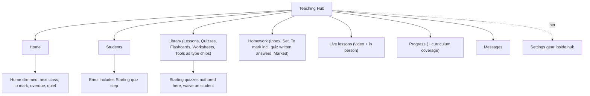
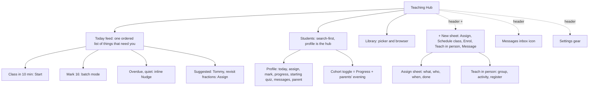
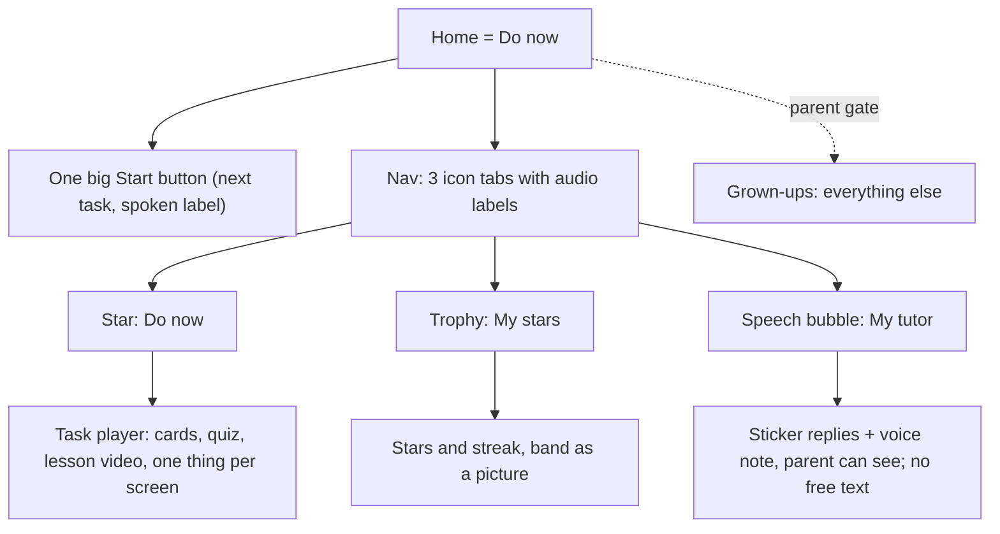
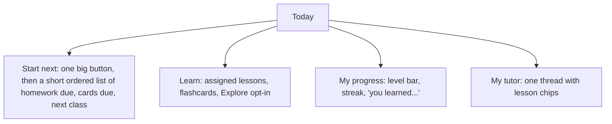
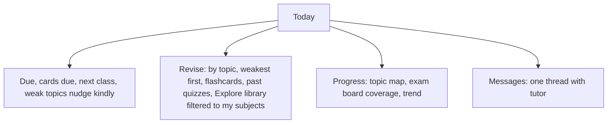

# X3 journal: Information architect review of the Teaching Hub structure

Persona: senior IA / UX lead, desktop, code-and-docs review only (no browser, no product code changed).
Sources: 00-brief.md (esp. sections 7, 7A.2, 7A.3, 8), 01-inventory.md, 01b-actions.csv, 01c-data-truth.md, plus spot checks of `features/learninghub/` (panels.tsx:31 TAB_ORDER, home/TutorHome.tsx:50-172, home/ClassSnapshot.tsx:133-167, homework/MarkDialog.tsx, inperson/*).
Friction rows: X3-friction.csv (X3-01 to X3-31).

---------------------------------------------------------------------

## 1. Card-sort: every screen, feature and job today, grouped by the user's real JOB

### 1a. Tutor jobs

| Tutor job | What exists today, and where it lives now | Tabs that own a piece |
|---|---|---|
| **Today / what next** | Home: live banner, Next lesson, "Needs your attention", six quick actions, mastery grid, improvers, nudges, activity, rhythm; Live lessons "Upcoming"; hero with 4 stat tiles | Home, Live lessons |
| **Students** | Students tab (filters, search, Groups, student cards, Enrol modal, edit/pause/un-enrol); Waive placement (Placement tab bottom); per-child Progress; "Message" on card; Flashcards per-child rows | Students, Placement, Progress, Flashcards, Messages |
| **Content library** | Lessons (list plus curriculum grid, editor, reader), Quizzes list, Question bank (x2 identical), Placement test list/authoring, Flashcards cards, Tools (216 tiles), Worksheets (only an attachment count of 1), Topics manager | Lessons, Quizzes, Placement, Flashcards, Tools (+ subject sidebar) |
| **Assign** | 14 entry points (01-inventory duplicate-path table): Home x3, student card, group tile, lesson list/reader, worksheet, quiz card, in-person follow-up, Homework tab button, live workspace tabs, and 2 separate direct-post mini-forms | Home, Students, Progress, Lessons, Quizzes, Placement, Homework, Live, In-person |
| **Mark** | Homework "To mark" (MarkDialog, has Mark and next); Quizzes "Marking" sub-tab; Placement "Marking" sub-tab; Home Attention rows (tab jump only) | Home, Homework, Quizzes, Placement |
| **Teach live / in person** | Live lessons (schedule video, lobby, call, board, 7-tab workspace); Teach in person (InPersonApp: setup, capture grid, results); Lessons "Go live" (StartRemoteSyncButton); broadcast banner (Home + Lessons); Tools as launcher (ToolHost) | Live lessons, Home, Lessons, Tools |
| **Progress and reporting** | Progress tab (mastery table, Recalculate, per-student ProgressView); Home mastery grid, improvers, weekly rhythm; curriculum coverage (CurriculumRings on Progress AND CurriculumCard on Lessons); Results sub-tabs on Quizzes and Placement; Flashcards KPIs. No parents' evening export exists | Progress, Home, Lessons, Quizzes, Placement, Flashcards |
| **Messages** | "Student message centre" (folder per child, thread per lesson, General); "Message" on card; "New message" | Messages (+ Students) |
| **Setup** | Settings link out to /freelancer/setup?tab=hub (pass mark, require placement, show answers, retakes, homework due days, levels, year groups, subject colours, question types); Topics/subject/year pickers inside hub; provider Select; Hide toggle | Hero (link), Lessons sidebar, Setup app |
| Non-job noise | Header stat tiles (Subjects, Lessons, Worksheets, Students), subject bar on every tab, "Checking access" gate | Hero, shell |

Observation: 9 jobs, 11 tabs, and no job has a single home. Only Students and Messages are near one-to-one. Assign is in 9 tabs, Mark in 4, Teach in 4, Progress in 6, Library in 5.

### 1b. Family jobs (parent and child)

| Family job | Today | Tabs |
|---|---|---|
| **What do I do now** | Home (parent: summary strip, hero, 4 cards; child: banner, greeting, level bar, streak, next lesson, flashcards due, homework due, results, how I'm doing) plus Homework tab plus live "Resume" banner | Home, Homework, Quizzes, Starting quiz, Flashcards |
| **My learning** | Lessons (opens on curriculum grid), Quizzes (709 incl. 599 locked), Starting quiz, Flashcards, Homework | 5 tabs |
| **My progress** | Home "My level" and "How I'm doing", Progress (parent only), Lessons curriculum grid ("What I've covered") | Home, Progress, Lessons |
| **Message my tutor** | Messages (three-column email client) | Messages |
| Parent-only | Live lessons (join), Tools (visible to parents; 01-inventory tab table says Tools=Y for parent), Placement | Live, Tools, Placement |

Kid mode: 7 tabs. Parent: 10 tabs. Four jobs, seven-to-ten tabs.

---------------------------------------------------------------------

## 2. Critique of the current 11-tab structure

Verdict: the structure is organised by data type (what the database calls things), not by job (what the tutor is doing). It is a table-of-contents of the schema.

**2.1 Navigation depth is 3 to 4, not 1 to 2.** Portal side nav, then hub tab (11), then sub-tab (Placement 4, Quizzes 4, Homework 2, Live 2), then a second chip layer (subject, year, status), then the item. Marking a written answer = side nav, Home, attention row, Quizzes tab, Marking sub-tab, item (01-inventory sub-tab list; TutorHome.tsx:169). Evidence: 01-inventory "Sub-tabs, modals, drawers".

**2.2 Eleven tabs exceed a scannable set.** Brief 7A.2 point 1: the strip scrolls at ~900px, and 01-inventory shows why: below 1024px the whole portal is in drawer mode and tab icons vanish (HubTabs.tsx:113). Miller and Hick both say too many peers; a tutor's jobs are 6 to 7.

**2.3 Duplicate entry points (the same verb reaches the same object by many routes).**
- Assign: 14 entry points, 3 different code paths (shared HomeworkForm intent, direct-open form, and two separate direct-post mini-forms: HomeworkForLesson.tsx:80,108 and inperson/api.ts:48). The "same" action behaves differently by origin; the Home nudge "Assign" chip does not even preselect the student (ClassSnapshot.tsx:163-167).
- Enrol x3, New quiz x2, New lesson x2, Start a live class x3, Message x2, Progress x2, Marking x2 (01-inventory "Other duplicated actions").
- Next lesson on Home duplicates Live lessons "Nothing coming up" (01c section 1.3).
- Quick actions "New lesson" and "Assign homework" work by clicking hidden DOM buttons via regex (teachKit.tsx:310): fragile IA held together by string matching.

**2.4 The same object lives in two places.**
- Curriculum coverage: CurriculumRings (Progress) and CurriculumCard (Lessons), with different lesson definitions (01c section 6).
- Question bank appears identically under Quizzes and Placement (TutorAssess.tsx:63).
- Marking: Home to Homework "To mark", Quizzes "Marking", Placement "Marking": three queues for one job.
- Mastery: tutor grid reads stored rows, child dashboard computes fresh (01c section 7, #7).
- Lessons vs "Notes": one collection (hubNotes) holds interactive lessons, plain notes, whiteboard snapshots and worksheets, so "Lessons 7,894" is really "notes" (01c 1.1).
- Live class rows live in `hubLessons` while lesson content lives in `hubNotes`: the code has "lesson" and "note" the wrong way round relative to the tab labels.
- Homework is both a content type (HomeworkForLesson, worksheet-as-homework) and an assignment (Inbox/Marked/Not handed in). The tab "Homework" has a segmented control labelled "Set homework" that is both a list and a button (01b-actions.csv row Homework).

**2.5 Naming inconsistencies (01-inventory "Naming inconsistencies").** `notes` key vs "Lessons" label; `diagnostic` vs Placement test vs Starting quiz vs Baseline; `questions`/`doubts` vs "Student message centre" vs "Messages"; `dashboard` vs "Progress" vs "How I'm doing"; My Classroom / Teaching Hub / Learning Hub; Assign has 6 verb phrases; "Live lessons" vs "Lessons" vs "Teach in person" vs "Schedule video lesson" vs "broadcasting". Parent copy says "your provider" vs "your tutor".

**2.6 Home does too much.** 10 blocks, roughly 220 words above the fold (01b Home row), ~12 colours. Three of them are stats that mislead (01c: 7,894 vs 7,470, "Worksheets 1", "23 things" mixing papers/pairs/people). Home is a dashboard, not a Today: it answers "how is my catalogue" before "what do I do at 7pm".

**2.7 Scale: each library tab opens on the whole catalogue.** 8,971 quizzes, 51,873 cards, 7,894 lessons, 78 placement tests, 216 tools, all unfiltered by the tutor's actual students (7A.2 points 2 and 3). IA principle: default scope = what is mine, then browse-all behind it.

**2.8 Setup is in another app.** Pass mark, show answers, retake wait and placement-required are edited in /setup?tab=hub but change behaviour inside Quizzes and Placement; no contextual override at the point of use (01-inventory "Settings"). Staff never see it.

**2.9 Family side mirrors the tutor structure when it should not.** Kid mode gets 7 of the tutor's 11 tabs; parent gets 10. A child asks "what do I do now" and is offered Quizzes (709), Starting quiz, Homework, Lessons, Flashcards as peers. Homework and Home give different answers (01c 3.1). Lessons opens on a tutor-facing curriculum grid.

**2.10 State duplicated in the shell.** Banner polls twice on two tabs; Lessons stays mounted hidden on every tab (LearningHubApp.tsx:263). Not IA per se, but it is why Home/Homework can disagree.

What is good and should survive: "Needs your attention" as a concept, the six quick actions as a verb list, groups with one-click assign, Homework's status counts (Inbox/To mark/Marked/Not handed in), the student card action trio, Teach in person as a first-class mode, Waive placement, kind mastery names, the Grown-ups gate.

---------------------------------------------------------------------

## 3. Three alternative tutor structures

Shared principles in all three: (1) Assign is one sheet (what, who, when, done) launched from anywhere; (2) one Mark queue; (3) Placement is a step in Enrol and a status on the student, authoring lives in Library; (4) the hero stat tiles, subject bar and Hide button are deleted; (5) Setup becomes a gear inside the hub with per-item overrides; (6) library defaults to "my students' years and subjects"; (7) Messages is a header inbox icon with unread count.

### Option A: Six job tabs (recommended)

```mermaid
graph TD
 HUB[Teaching Hub] --> TODAY[Today]
 HUB --> STU[Students]
 HUB --> LIB[Library]
 HUB --> TEACH[Teach]
 HUB --> PROG[Progress]
 HUB --> MSG[Messages]
 HUB -.header.-> ASSIGN["+ Assign (global sheet)"]
 HUB -.header.-> GEAR[Settings gear]
 TODAY --> T1[Next class + Start]
 TODAY --> T2["To mark (one queue: homework, written quiz, starting quiz)"]
 TODAY --> T3[Overdue / quiet with Nudge]
 STU --> S1[Student list + groups filter]
 STU --> S2[Student profile: today, assign, mark, progress, starting quiz, messages, parent, overrides]
 STU --> S3[Enrol wizard: details, subjects, starting quiz on/off/skip, parent invite]
 LIB --> L1["Scopes: Mine / Recent / For my students / All"]
 LIB --> L2["Types: Lesson, Quiz, Flashcards, Worksheet, Starting quiz, Tool"]
 LIB --> L3[Coverage view by curriculum area]
 LIB --> L4[Create: lesson, quiz, question bank]
 TEACH --> C1[Schedule video class / Upcoming / Past]
 TEACH --> C2[In-person class: register, activity, results]
 TEACH --> C3[Tools launcher]
 PROG --> P1[Cohort mastery table]
 PROG --> P2[Per-student report / parents' evening export]
 PROG --> P3[Curriculum coverage per student]
 MSG --> M1[Unread first, one thread per child]
```

Tab count 11 to 6. Home-of-each-job: Today, Students, Library, Teach, Progress, Messages map 1:1 to card-sort rows 1,2,3,6,7,8; Assign is the cross-cutting verb; Mark lives in Today; Setup is a gear.

### Option B: Conservative, keep tabs but merge to 7

Keeps the words the tutor already knows (Homework, Live lessons), so lowest retraining and lowest engineering risk. Still leaves Assign with two homes (Library and Homework) and Marking split across Homework and Home.

### Option C: Task-first (Today feed, global Assign sheet, student profile as hub)

Three top-level items. Teach and Progress stop being places and become verbs and views. Highest reduction, highest retraining, and Teach (a "mode" with tools, board, register) loses a visible home, which risks the persona T3 (camp teacher) who needs Teach in two taps.

### 3a. Tutor click counts, today vs A, B, C

Definition: a click = one tap/click; typing, scrolling and reading are not counted (but noted). Counted from being inside the hub (side-nav click to enter it excluded everywhere). Where a route has a "Mark and next", "Send" or "Save" that ends the task, it is counted.

Assumptions (explicit):
1. Test tenant like Amir: 8 students, 9 hand-ins + 7 written to mark, quiet student Tommy, a Year 5 Maths group.
2. Today counts are derived from the 01-inventory entry points and code (TutorHome.tsx, MarkDialog "Mark & next", HomeworkForm intent flow, StudentsPanel, LiveLessonsPanel, InPersonApp), not measured live. Each chip/filter or picker selection = 1 click. HomeworkForm is assumed to need what + who + due + confirm.
3. Marking: each item needs one commit click. Today only homework has "Mark & next" (MarkDialog:12); quiz written-answer marking assumed open + save per item.
4. Proposed structures assume defaults: library scoped to the group's year/subject, Assign sheet due-date chip "Tomorrow", Enrol wizard defaults (starting quiz on, parent invited), in-person register defaults all present, single unified Mark queue with Mark and next across types.
5. Scenario 10: flashcards are per-topic cards not decks and worksheets are 1 attachment in the demo tenant (01c 1.1, 2), so "worksheet" is an assumption about a Library type that must be modelled properly; today's count assumes it can be found under Lessons > Science > Cells > Year 8.
6. Scenario 5 today has a dead end: no UI calls endRemoteSync (01c section 5).

| # | Scenario | TODAY | A (6 tabs) | B (7 tabs) | C (task-first) |
|---|---|---|---|---|---|
| 1 | 6:55pm, what do I do? | 1 click to first action (Home attention row); 0 to see but ~220 words, 10 blocks, scroll to reach "Next lesson" and attention | 1 (Today: Start next class or Mark 16); 0 scroll, ~60 words | 1 (slimmed Home) | 1 (feed row); feed is the first screen |
| 2 | Clear marking (9 + 7) | 28: Home attention 1, filter To mark 1, open 1, Mark and next x9 = 12; then Home 1, attention row 1, open+save x7 = 14, = 16, total 28; 2 tabs, 3 sub-screens | 17: Today 1 (queue), 16 saves (Mark and next across types) | 18: attention 1, Mark and next x9, +1 switch to written, x7 | 17, plus keyboard mode (0 clicks between items) |
| 3 | Homework for Year 5 Maths on fractions | 8: Lessons 1, search+year 1, open/preview 1, Set for children 1, group 1, due 1, confirm 1 (+ topic) = 8 | 6: Library 1, preview 1, Assign 1, group 1, due chip 1, confirm 1 | 7: Library 1, filter 1, preview 1, Assign 1, group 1, due 1, confirm 1 | 5: + 1, pick item with inline peek 1, group 1, due 1, confirm 1 |
| 4 | Enrol Year 3, start them, tell parent | 23: Students 1, Enrol 1, subjects 3, save 1 = 6; Placement tab: subject 1, year 1, Set for children 1, student 1, confirm 1, + tab 1 = 6 (one subject); first lesson via Lessons 7; message parent 4 (tab, New, recipient, send) | 10: Students 1, Enrol 1, Next 1, subjects 3, Finish 1 (starting quiz + parent invite by default), profile "First lesson" 1, suggested lesson 1, send 1 | 14: enrol wizard incl. starting quiz step 7, first lesson via Library/Assign 7 | 9: + 1, Next 1, subjects 3, Finish 1, profile "Start them" card 1, assign suggested 1, send 1 |
| 5 | Schedule video lesson next Tue, then run it | 8: Live tab 1, Schedule 1, date 1, time 1, who 1, save 1 = 6; then Join 1, Start 1 = 8. Forgotten broadcast: cannot be ended from UI | 7: Teach 1, Schedule 1, date 1, time 1, group 1 (defaulted where possible), Save 1 = 6; Today Start 1 (lobby auto) = 7; End on banner 1 | 8: Live 1 ...same as today, End on banner 1 | 7: + 1 Schedule 1 date 1 time 1 group 1 save 1; Today Start 1; End 1 |
| 6 | Teach in person, group of 6 | 6 to start (Home Teach in person 1, group/students 2, activity 2, Start 1); no register exists (grep of inperson/ finds none); quiz + record results ~+6 = 12 | 5 to start (Teach 1, In person 1, group 1, activity 1, Start 1); register default-present 0-2; quiz + results ~+4; total ~9 | 6 (Live 1 ...) total ~10 | 5 (+ 1 ... Start 1); total ~9 |
| 8 | Nudge quiet Tommy | 5: Students 1, "Needs attention" filter or search 1, Message 1, thread/General 1, Send 1. The Home nudge chip says "Assign", not message, and does not preselect the student (ClassSnapshot.tsx:163) | 2: Today "Quiet: Tommy" > Check in 1 (kind template prefilled), Send 1 | 4: Students 1, filter 1, Message 1, Send 1 | 2: feed row Check in 1, Send 1 |
| 10 | Find Y8 science cells flashcards + worksheet, assign both | 15: Flashcards tab 1, subject 1, topic 1, year 1, assign topic 2 = 6; Lessons 1, Science 1, Cells 1, Year 8 1, open worksheet 1, Set worksheet as homework 1, student/due/send 3 = 9 | 10: Library 1, Science 1, Year 8 1, Cells 1, tick two 2, Assign selected 1, who 1, when 1, confirm 1 | 12: Library 1, filters 3, type chip 1 x2 tick/assign each 2, = 12 | 8: + 1, filters (defaults from student) 2, tick two 2, who 1, when 1, confirm 1 |

Summary of the top five (1, 2, 3, 4, 5): today 1 / 28 / 8 / 23 / 8; A 1 / 17 / 6 / 10 / 7; B 1 / 18 / 7 / 14 / 8; C 1 / 17 / 5 / 9 / 7.
A beats today on 7 of 8 scenarios and ties on one (#1, where the gain is scroll and words, not clicks). Nowhere is A worse. C wins on clicks by 1 in 4 scenarios but has the retraining and Teach-visibility cost above. B wins less and leaves Assign and Mark split.

Non-click gains not captured in counts: #1 words above the fold ~220 to ~60; #2 screens 3 to 1; #5 dead end removed; #6 register exists; #8 message replaces mis-labelled "Assign" chip; #10 needs the Worksheet and Flashcard-deck objects to be real (data model dependency).

---------------------------------------------------------------------

## 4. Family structure per age band

Family jobs are the same four for everyone (do now, learn, progress, tutor); the age band changes presentation, not the job list. Nav is 3 to 4 items, not 7 to 10. Kid mode and Grown-ups gate are kept.

### KS1 (Years 1 to 2): 3 icons, no reading to navigate

Clicks: what do I do now = 1 (Start); do it = 0 further nav; see how I'm doing = 1; message tutor = 2. Hidden: library browsing, quizzes list, curriculum grid, scores as percentages, timers.

### KS2 (Years 3 to 6): 4 tabs

Homework, Quizzes, Starting quiz, Flashcards stop being tabs. Homework, quizzes and starting quiz appear as tasks in Today (they are assigned items); Learn holds lessons and flashcards. Clicks: do now 1; finish early 2 (Learn, pick); message 2.

### KS3 to 4 (Years 7 to 11): 4 tabs, revision-first, no baby UI

Curriculum map lives here (Progress), opt-in Explore lives here. No kid-mode gate by default, parent sees the same data through the parent view.

### Parent (any age): 4 tabs, not 10
Today (per child: next class + Join, anything overdue, "nothing needed" state), Progress (term view, printable, plain words), Messages (tutor), Learning (open the child's view). Drop Tools, Placement, Quizzes, Flashcards and Live lessons as parent tabs (Join lives in Today).

Where family deliberately does not mirror tutor: no Library, no Placement/Starting quiz tab (it is a task in Today), no Students, no Tools, no curriculum grid for KS1/KS2, messages are one thread not folders.

---------------------------------------------------------------------

## 5. Vocabulary: one word per concept (UI and code)

| Concept | Retire | Tutor UI | Child UI | Parent UI | Code (target, alias existing) |
|---|---|---|---|---|---|
| The product area | My Classroom, Learning Hub | Teaching Hub | My learning | My child's learning | `hub` / `learninghub` (keep route) |
| Teaching content (interactive page, video, steps, worked example) | Notes, "Lesson" for class events | **Lesson** | Lesson | Lesson | `lessons` (rename from `notes`; today `hubNotes`) |
| A timed teaching event online | Live lessons, Schedule video lesson, broadcasting, RemoteSync, Rejoin | **Video class** (verb: Schedule a class) | Live class, "Join" | Live class, "Join" | `classes` (rename from `hubLessons`, mode `video`) |
| A timed teaching event in the room | Teach in person | **In-person class** (verb: Teach in person, shortened) | (none, tutor-led) | (none) | `classes`, mode `in_person` |
| The place for both | Live lessons tab | **Teach** | n/a | n/a | |
| Starting assessment | Placement test, diagnostic, baseline, reset baseline, waive | **Starting quiz** (skip = "Skip starting quiz") | Starting quiz | Starting quiz | keep API `diagnostic`, UI label only |
| Quiz | Assessment | Quiz | Quiz | Quiz | `assessment` |
| Bank of questions | Question bank (x2) | Question bank, inside Library once | (hidden) | (hidden) | |
| Flashcards | Cards, decks (mixed) | Flashcards (set = "deck") | Flashcards (KS1: Cards) | Flashcards | `flashcards` |
| Printable | Worksheet (attachments) | Worksheet | Worksheet | Worksheet | needs its own type |
| Interactive tool | Tool | Tools | Tools (in class only) | n/a | `tools` |
| The verb of giving work | Set homework, Set for children, Set as homework, Set worksheet as homework, Set a quiz, Assign homework | **Assign** | (n/a) | (n/a) | one `assign` intent, one form |
| The thing assigned (with due date and hand-in) | Task, set | Homework | Homework | Homework | `homework` |
| Things waiting on the tutor | Needs your attention, Inbox, To mark x3 | **To mark** (one queue) and **To do** on Today | n/a | n/a | one `mark` intent |
| Reaching the tutor/student | Student message centre, doubts, questions, New message | **Messages** | Messages / My tutor | Messages | rename key `questions` to `messages` |
| Kind check-in for a quiet learner | Nudge, Needs a nudge, "Quiet 14+ days" | **Check in** | (never shown) | (never shown) | |
| Progress | Dashboard, How I'm doing, level, mastery | **Progress** | My progress | Progress | `progress` (rename `dashboard`) |
| Progress bands | Learning/Developing/Secure/Mastered vs Getting started/Getting there/Got it!/Mastered | one set, tutor-configurable: Getting started, Getting there, Secure, Mastered | same | same | `masteryBands` |
| A set of learners | Class, group, cohort | **Group** | (not shown) | (not shown) | `groups` |
| Who the tutor teaches | Children, learners, enrolments | **Students** (tutor screens), "child" in parent copy | I / me | my child / Name | `student` UI, `enrolment` data |
| Who runs it | your provider / tutor | your tutor | my tutor | your tutor | |
| Hub configuration | Settings link out to Setup | **Settings** (gear inside hub) | n/a | n/a | |
| Curriculum coverage | National curriculum coverage, Where our lessons fit, What I've covered, Curriculum map | **Coverage** (view in Library and Progress) | My map (KS3-4 only) | Coverage | |

Rule set: one noun per concept; "Lesson" is only ever content; "Class" is only ever an event; "Group" is only ever people; "Assign" is the only verb for giving work; child and parent words are simplifications of the tutor word, never a different word.

---------------------------------------------------------------------

## 6. Recommendation

Adopt Option A (Today, Students, Library, Teach, Progress, Messages) plus the global Assign sheet from Option C, and take Option B's slimmed-Home as the first shippable step.

Reasons:
1. It matches the card-sort: 6 tabs map to the 6 place-jobs; Assign, Mark and Setup (cross-cutting) become a sheet, a queue and a gear.
2. Clicks: beats or ties today on 8 of 8, cuts marking 28 to 17, homework 8 to 6, enrol-and-start 23 to 10, and removes two dead ends (no End broadcast, no register).
3. It fixes the largest evidenced structural faults directly: 14 assign entries into 1, 3 mark queues into 1, curriculum map duplicated (Progress + Lessons) into 1 Coverage view, Question bank x2 into 1, Placement tab into an Enrol step.
4. Lower risk than C: keeps Teach as a visible mode (camp teachers, T3) and Progress as a place (parents' evening scenario #7), while borrowing C's best ideas (student profile as hub, Assign sheet, inline Check in).
5. Retraining is contained: 6 clear names, and Homework/Assign/Mark verbs remain.
6. Family gets 3 to 4 items by age, not 7 to 10, and stops mirroring tutor tabs.

What I would keep: "Needs your attention" (as Today), the six quick actions (as the + menu: Assign, Schedule class, Enrol, Teach in person, New lesson, New quiz), Groups with one-click assign (as a filter on Students and a "who" option in Assign), Homework statuses (Inbox/To mark/Marked/Not handed in), the student card action trio, Waive (as Skip starting quiz), Teach in person as first class, kind mastery names, the curriculum mapping data, Grown-ups gate, privacy-safe YouTube, one-tap flashcard review.

What I would drop: hero stat tiles, persistent subject bar, Hide button, Tools as a tab (become Teach launcher plus Library type, hide the 138 "coming soon"), Placement and Settings as top-level places, "Student message centre" folders, curriculum grid as the opening view of Lessons, the "weekly rhythm" chart from Today.

Sequencing (dependencies, in evidence order): (1) fix data truth items that would make the new Today lie (01c ranks #1, #2, #8, #6); (2) unified Assign sheet (removes 14 entry points, prerequisite for everything); (3) one Mark queue; (4) merge Library types with default scope; (5) Enrol wizard with Starting quiz; (6) rename tabs; (7) family age bands. Prerequisite risk: Worksheet and Flashcard-deck as real objects (today 1 attachment count; cards are per-topic), needed for scenario 10.

Open question for the owner: is `Class` acceptable for a session given tutors say "lesson"? Alternative is Lesson (event) and Topic-lesson or Resource (content), but the code already inverts this (`hubLessons` vs `hubNotes`), so renaming the content label is more disruptive.

Top 10 frictions and top 5 keeps are in X3-friction.csv (severity 4 first) and section 6 above.
