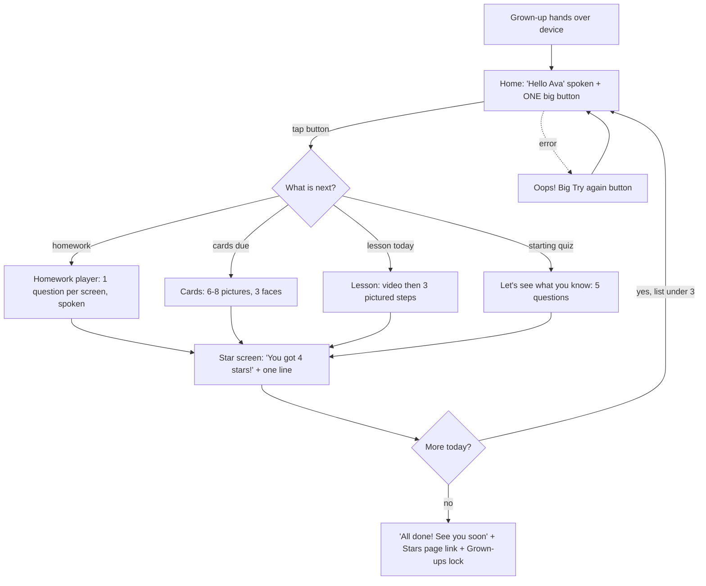
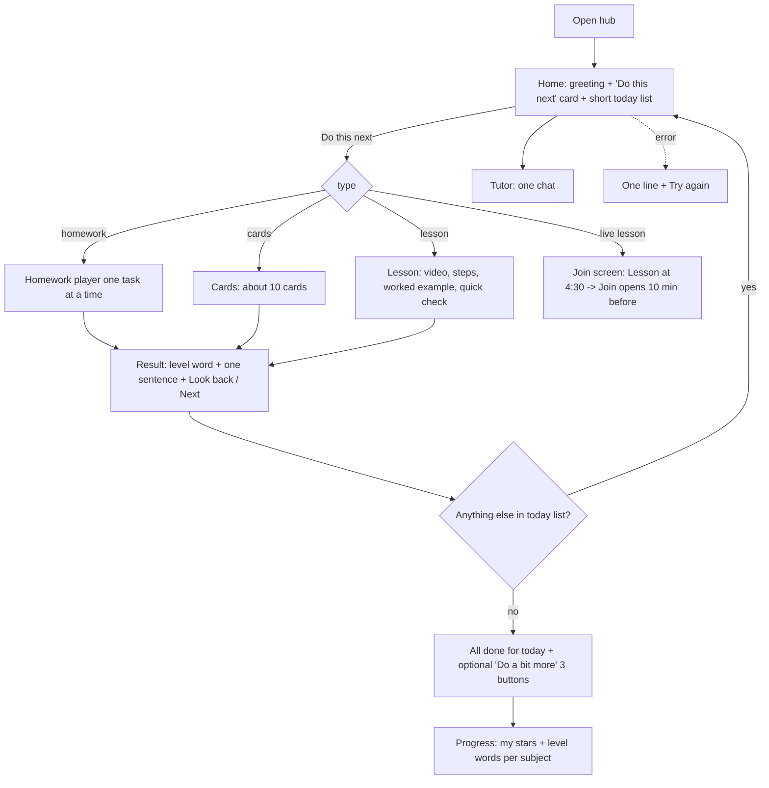
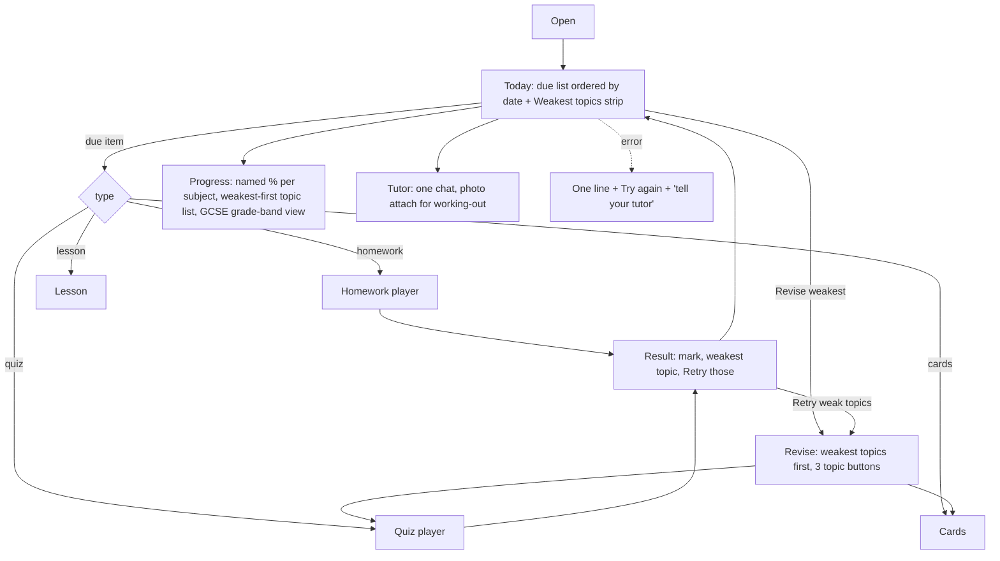

# 08 - Child experience: age-banded design for KS1, KS2 and KS3-4

Sources: brief §8, `01-inventory.md`, `01c-data-truth.md` §3, journals C1-C4, P1, P2, T4, `05-structure-options.md`, `06-proposals.md`. Evidence ids are friction ids from `02-personas/*-friction.csv`. Code refs are under `features/learninghub/` unless stated. Code-read only, no live run.

Legend: **[NOW]** buildable tonight on the branch (front-end / additive, no auth or schema change). **[NEXT]** needs an additive field or small server change, owner review. **[ROADMAP]** larger or needs owner decisions.

---

## 0. Cross-cutting design (applies to every band)

### 0.1 How the age band is chosen
- Source: the enrolment's `yearGroup` (types.ts:81, with `yearGroupAuto` at :83). It is already on the enrolment and used by the audience filter. No new data.
- Mapping: Reception-Y2 = **KS1** (age 5-7). Y3-Y6 = **KS2** (8-11). Y7-Y13 = **Teen** (KS3, KS4/GCSE, sixth form). Unknown year: default **KS2** (safest middle) and show the parent a one-line "Choose {name}'s year" prompt behind the gate.
- Override: a parent (behind the Grown-ups gate) or the tutor can set "Display style: Little / Junior / Teen" per child. Children cannot change it. Reason: a bright Y3 reader can be moved up, a Y6 child with SEND can be moved down; the band is a presentation choice only, never a content gate.
- Same data, three presentations: one `useChildHome()` data source, three layout components. No band gets different truth (see 0.4).
- **[NOW]** derive band from `yearGroup` in KidMode/StudentHome and switch layouts. **[NEXT]** the per-child override (enrolment field `displayBand`).

### 0.2 Session-length targets
| Band | Target session | Hard shape |
|---|---|---|
| KS1 | 10-12 min | Today list max 3 items; a quiz max 6 questions; a flashcard session max 8 cards (cap `SESSION_MAX`, hubSrs.ts); a lesson max 4 screens. After the list: "All done" and stop. |
| KS2 | 15-20 min | Today list max 4; quiz 8-10 questions; flashcards max 15; lessons in short steps. |
| Teen | Flexible, default plan 20-30 min | Today list max 5; "Revise" is open-ended but shows a suggested 20 min block; no forced stop. |
- Session estimate is always shown on the primary button ("about 8 min", already computed for flashcards: StudentFlashcards).
- After the plan is done the child sees **Done for today**, not more content. Bonus is opt-in behind one "Do a bit more" button (C2-08, C3-06). Nothing makes a session longer than today; tonight only shortens and reorders.

### 0.3 Tone guide
Rules: second person ("you"), present tense, max ~8 words per KS1 sentence, ~12 KS2, teens neutral and factual. Praise effort and specifics, never ability. Never show a pass-mark sum to KS1/KS2. Never red for "not yet".

| Situation | KS1 exact words | KS2 exact words | Teen exact words |
|---|---|---|---|
| Homework not yet started, past its date | "Waiting for you" | "Waiting for you - let's do it today" | "Overdue (was due Tue)" shown neutral grey, no triangle |
| Homework handed in after the date | "Handed in!" (no lateness shown to the child; tutor and parent still see "late") | "Handed in - thanks!" | "Handed in Wed" |
| Nothing to do | "All done! See you soon." | "All done for today. Nice work." | "Nothing due. Want to revise something?" |
| Wrong answer (per question) | "Nearly! Try again." then the right answer shown with a tick-picture | "Not quite yet. Here is how it works:" + short explanation | "Incorrect. Correct answer: ... Why: ..." |
| Quiz result below pass | "Good try! You got 3 stars. Try again?" | "Getting there - 6 out of 10. Try again or look back?" | "6/10. 4 marks below the pass mark. Weakest: Fractions. Retry those?" |
| Quiz result pass | "Brilliant! 5 stars" | "You got it - 9 out of 10" | "Passed - 9/10" |
| Waiting for marking | "Your tutor will look at this" | "Your tutor will mark this soon" | "Awaiting marking" |
| Flashcard ratings | face icons: "Try again" / "Nearly" / "Got it" | "Show me again" / "Tricky" / "Got it" / "Easy" | Again / Hard / Good / Easy (keep) |
| Timer up (only if timer on) | not used | "Time's up - your answers are handed in" (gentle chime off by default) | "Time is up. Answers submitted." |
| Load error | "Oops! Tap to try again." + big button | "Something went wrong. Try again." + button | same as KS2 + "Tell your tutor if it keeps happening" |
| Can't retake | "Ask a grown-up" + icon | "Ask your tutor if you'd like another go" | "One attempt only. Ask your tutor for another." |
| Live lesson not on | (hidden) | "Your lesson starts at 4:30" | "Lesson at 16:30" |

Words to USE: go, do, try, again, nearly, got it, stars, all done, waiting for you, your tutor, grown-up, learn, practise, cards, quiz, lesson. Words to AVOID (child-facing): overdue, late, failed, wrong, incorrect (KS1/KS2), pass mark, points short, score arithmetic, attainment, mastery, baseline, placement, diagnostic, curriculum, programme of study, coverage, submit/submission, assessment, "locked", "the server", "API", "localhost", "timed out", "PEE"/other tutor jargon without a gloss. Keep (owner point 12): "Getting there", "pass or not yet, it all counts", "A little every day beats a lot once".

### 0.4 One truth
The child never sees two answers to one question. Rules (all **[NOW]**, from 01c §3):
1. Home and Homework tab share one fetch. A failed/late fetch shows a friendly retry, never "No homework right now" (01c 3.1, C-owner point 4).
2. "Due soon" and "waiting for you" are separate groups; overdue is never labelled "soon" (StudentHome.tsx:54,98).
3. One progress story per child: KS1 = stars this week; KS2 = level word + subject chips (band names, not percentages); Teen = one named percentage per subject ("Maths 78%") sourced from the same attempt set as Latest results. Mastery hides when there are zero results (01c row 2). "My level 75%" / ring 78% / chip 90% collapse to one (01c row 4).
4. Flashcard counts are today's session ("8 cards, about 4 min"), not "22,229 to review" (01c §2).

### 0.5 Shell, loading and errors (owner point 1)
- **[NOW]** Instant shell: tab strip and the child's name render immediately; Home shows a 3-row skeleton with a spoken-friendly "Getting your things ready..." line, not grey blocks with no message. Keep today's tasks in a small in-memory / sessionStorage cache keyed by child id and revalidate in the background (stale-while-revalidate). Do not remount-and-refetch every tab (LearningHubApp.tsx:263 `key={active}`); keep Home mounted.
- **[NOW]** Single child error component: KS1 "Oops!" + huge Try again button + sound optional; KS2/Teen one line + one button. Raw `e.message`, hostnames, "15s" never shown to a child (homeKit.tsx:130-131, types.ts:144, C1-05, C4-09). Technical detail goes behind a Details toggle for tutors only.
- One automatic retry, then the button. While waiting: a tiny animated dot (respects reduce-motion) plus text.

### 0.6 Read-aloud and reduce-motion requirements
Read-aloud (today: none outside one phonics block, blocks.tsx:28-39,236; C1-02, C4-02):
- KS1: **on by default**; speaker icon on the Today button, every question prompt, every answer option, result headline, and lesson step. Tapping the card itself also reads it. Navigation tabs are icons + spoken labels.
- KS2: speaker icon available on prompts and lesson text; default off; per-child switch.
- Teen: "Read this" on selected text and a per-page button; default off.
- Implementation **[NOW]**: one `<Speak text=... />` component around `window.speechSynthesis` (the phonics `speak()` helper already exists), `lang` from the content, rate 0.9 for KS1, a stop control, works offline. Must not auto-play audio without a tap except the KS1 "Hello Ava, tap the big button" on first open, which itself follows the child's `readAloud` setting. **[NEXT]** recorded human audio for KS1 core prompts; server TTS for consistent voices.
- Highlight the sentence being read (optional, dyslexia-friendly), controlled by the reading options.

Reduce-motion / calm:
- Honour OS `prefers-reduced-motion` everywhere (today only partially, C4-12: motion.tsx). Add `calm` mode that also removes staggered entrance animations (StudentHome.tsx:138,235), confetti (DoneStep.tsx:12,40; LessonPlayer.tsx:292-316), XP counters, flame animation, auto-advancing carousels and flashing timers.
- Calm mode does not remove feedback; it swaps motion for a still tick and text.
- Touch targets >= 48px KS1, >= 44px others; focus ring visible (X1).
- Sounds: off by default in all bands; opt-in.

### 0.7 Per-child support profile
One profile object per child (additive enrolment fields, **[NEXT]**; the UI for the parent can ship **[NOW]** against `localStorage` as a fallback per device but must not be presented as the real control until stored server-side, otherwise it desyncs). Server applies it, the client only reads it, so a child cannot bypass or lose it.

| Setting | Default KS1 | Default KS2 | Default Teen | Tutor controls | Parent controls | Child controls |
|---|---|---|---|---|---|---|
| Extra time (Normal / +25% / +50% / No limit) | No limit | Normal | Normal | **Yes (owner)**; applied over any quiz `timeLimitMins` at start (T4 one-change; TakeAssessment.tsx:77) | Request only | No |
| Timers visible (off entirely) | Off, never shown | Off unless quiz needs one | On only if the quiz is timed | Yes | Yes (turn off) | Can hide the countdown display, not the extra time itself (a11y, not cheating: the deadline is still enforced by the server) |
| Pause timer | n/a | Allowed | Allowed | Yes | Yes | Yes (a "Pause" button; tutor sees pause count) |
| Streaks / stars-of-days | On as "days you learned" (soft) | On (soft) | Off (plain "5 active days" text) | Yes | Yes | No |
| XP / points / confetti / sounds | Off (stars only) | Off by default (tutor may enable stars) | Off | Yes | Yes | Can turn Calm on for themselves any time (one-way safe: child may only reduce stimulation) |
| Scores / percentages visible | Hidden (stars) | Band words | Shown | Yes | Yes | Can hide (never reveal what tutor hid) |
| Leaderboards / public ranking | Never exist | Never | Never | n/a | n/a | n/a |
| Read-aloud | On | Off | Off | Yes | Yes | Yes (toggle on any time; cannot turn off KS1 default if tutor forced it) |
| Reading options (font: default/dyslexia-friendly, size, line spacing, background tint, sentence highlight) | Large, wide spacing | Medium | Medium | Yes | Yes | Yes (comfort panel, child-editable and saved per child; today resets every visit, readingOptions.tsx:6, C4-03) |
| Reduce motion / Calm | Follow OS | Follow OS | Follow OS | Yes | Yes | Yes |
| Display band override | from year | from year | from year | Yes | Yes | No |
| Show live lessons | Yes | Yes | Yes | Yes | Yes | No |
| Message tutor | Off (grown-up asks) | On, canned + free text, parent-visible | On, parent-visible per tutor policy | Yes | Yes | n/a |

Principle: **tutor sets the default, parent can add support, the child can only turn things calmer/easier for themselves.** Nobody can quietly remove a support that a tutor/parent set for SEND; the child can add Calm and reading comfort but not remove extra time or a read-aloud that was forced. Every change is logged with who and when (safeguarding X2). Tutor sets these in the student profile (Students -> child -> "Support"), not per quiz (T4-01, T4-02). **[NOW]**: reading options global + saved, calm mode toggle, no-timer display for untimed quizzes. **[NEXT]**: server-applied extra time, stored profile. **[ROADMAP]**: profile templates ("Dyslexia", "ADHD", "Anxious about tests") and tutor-to-parent proposals.

### 0.8 How a parent sees a verdict without seeing kid-mode screens
Parents never need to hand the device over or open a KS1 screen to know how the child is doing.
- Parent Home (outside kid mode), first line, ahead of any child-voice hero (P1-01, P1-02, P2-05): a verdict per child in plain words:
  - "Ava: on track. Nothing needed from you."
  - "Ava: 1 homework waiting (Forces quiz, was due Tue). A nudge would help."
  - "Ava: nothing done this week. Lesson Thursday 4:30."
  Verdict = derived from overdue homework count, quiz activity in 7 days, and next lesson. Words: "On track", "A nudge would help", "Needs help". Same words across all bands.
- Second line: one sentence about what the child did ("Ava did 2 quizzes and 12 flashcards, best in Fractions").
- Tap opens **Progress for parents** (P2-16 parent wording variant), which uses the same data as the child but adult wording: named percentages ("78 out of 100 in Maths"), start-vs-now ("Ava started at 40%"), band explained; no streak flame, no "Getting started" chips.
- Notifications: overdue homework and lesson-soon (P1-03 / R-14) go to the parent, not surfaced as kid-mode banners. **[NOW]**: verdict line + parent copy for Home (front-end derived from data already loaded); **[NEXT]**: notifications, weekly email digest; **[ROADMAP]**: print/PDF report (R-12).
- Kid mode stays locked behind the Grown-ups gate (keep, owner point 12). Make the gate a simple one-digit sum or hold-3-seconds (P1-10, P2-13). Parents leave kid mode to read the verdict; the verdict is the first thing after the gate.
- Teens: parents see the verdict only, not the teen's raw messages, unless the tutor policy says otherwise (safeguarding decision, see 11-open-questions).

### 0.9 Tutor-side changes that make the child side possible
| Tutor-side change | What it gives the child | Status |
|---|---|---|
| Student profile page with a "Support" panel (extra time, timers, calm, read-aloud, reading, display band) | The whole 0.7 table; SEND children get a predictable calm layout without cloning quizzes | NEXT |
| "Set homework" one flow with pre-selected child, due date in kind language, and optional "estimated minutes" | Homework list is short and ordered; child sees "about 10 min" | NOW/NEXT (P-06, P-12) |
| Tutor "what {child} sees" preview and count ("Ava sees 4 quizzes, 3 lessons") | Removes the 709 quizzes / 599 locked wall (01c 3.4); tutor knows what the child sees | NEXT |
| Enrolled subjects honoured strictly (placement tests only for subjects the tutor enabled) | No French/German/Spanish placement tests for a Maths/English/Science child (owner point 6) | NOW (filter) |
| Cards assigned by deck, not by "all cards in enrolled subjects" | Daily card session = a few assigned/due cards, not 22,229 (01c 2) | NEXT |
| End-lesson button and server idle expiry 6 h -> 45 min (P-01) | Child never invited to a dead lesson (owner point 8) | NOW |
| Mark queue / feedback templates in kind language | Feedback the child reads is short; "not yet" wording | NEXT (R-2) |
| Message policy: one thread per child, tutor-only, parent-visible; no arbitrary "New message" | Safe one-chat Messages (owner point 7) | ROADMAP (R-9) but the child-side simplification is NOW |
| Quiz authoring: "explanation" field per question shown after a wrong answer | Wrong answers teach (principle 8.3) | NEXT |
| Tutor default per year band on quiz format (max questions) | Session length caps | NEXT |

### 0.10 Messages (all bands)
Today: three-column email client (owner point 7). Target: one chat with "Your tutor" (KS2/Teen), a "Ask a grown-up" prompt for KS1 (no free chat for KS1). Composer line: "Your tutor and your grown-up can read this. If something feels wrong, tell a grown-up." (C2-07). No "New message" to anyone else, no folders, no subject tree. A live-lesson chat is inside the lesson only while it is live. **[NOW]** UI simplification; **[ROADMAP]** server rules and DSL audit (R-9).

---

## 1. KS1 (age 5-7, Reception-Y2)

Goal: a pre-reader can start, finish and stop without reading. The grown-up is nearby.

### 1.1 Navigation
Three big icon buttons at the bottom (each 72px, icon + spoken label, no reading needed): **Today** (sun), **Play and Learn** (book/cards), **Stars** (star). Grown-ups lock stays top corner, small, labelled with a padlock. No tab strip. No Messages tab (grown-up handles messaging). No Starting quiz tab: a starting quiz appears in Today when due, labelled "Let's see what you know!".

### 1.2 Ideal flow



### 1.3 Home wireframe (phone, 390px)

```
+------------------------------------------+
| (Ava face)  Hi Ava!            [lock]    |  <- lock = Grown-ups, small
|                                          |
|   +------------------------------------+ |
|   |   [speaker]                        | |
|   |       ( PENCIL ICON )              | |
|   |                                    | |
|   |        Let's do your               | |
|   |        HOMEWORK                    | |
|   |        about 5 minutes             | |
|   |                                    | |
|   |      [   GO!   (huge green)   ]    | |
|   +------------------------------------+ |
|                                          |
|   After that:  [cards icon] [star icon]  |  <- max 2 small chips, icons only
|                                          |
|  [Today]   [Play&Learn]   [Stars]        |
+------------------------------------------+
```
Rules: one primary, at most two "after that" icon chips. No level bar, no percentages, no calendar, no results list, no curriculum. Order picked by server/client rule: homework waiting -> cards due -> lesson today -> starting quiz -> all done.

### 1.4 Player wireframes

Quiz / homework question:
```
+------------------------------------------+
| [x]  * * * o o o   (stars fill = progress)|
|                                          |
|  [speaker] What is 3 + 2 ?               |
|                                          |
|  +---------+  +---------+  +---------+   |
|  |  ooo    |  |  ooooo  |  |  oooo   |   |  <- big picture answers, spoken on tap
|  |  ooo?   |  |         |  |         |   |
|  +---------+  +---------+  +---------+   |
|                                          |
|            [ CHECK ]                     |
+------------------------------------------+
```
After Check: big tick + "You got it!" (or "Nearly! Try again.") in one line, then auto next button "NEXT". No per-question score. Written/typed answers replaced by tap, drag or voice/photo (C1-15). Max 6 questions. Hand-in = last screen says "All done!" with one button (C1-08 removes 3 screens).

Lesson:
```
+------------------------------------------+
| [x]            o o o (3 steps)           |
|  [ video, big play button ]              |
|  [speaker] "Let's count on 2 more"       |
|  ( picture of the idea )                 |
|         [ NEXT ]                         |
+------------------------------------------+
```
Homework detail: the child never sees a homework "detail" page: the Home button opens the first task directly (C1-09).

Cards: picture card + speaker; flip on tap; three faces (Try again, Nearly, Got it); no keyboard hints (C1-11).

Result screen: 1-5 stars, one sentence, one button ("Play again" / "Next"). No percentage, no pass-mark, no red.

### 1.5 KS1 must NEVER see
| Never see | Today's offender (file:line) |
|---|---|
| Server or developer error text, hostnames | homeKit.tsx:130-131; types.ts:144; lib/api.ts:130 (C1-05) |
| Percentages, pass-mark arithmetic ("25 points short of the 70%") | ResultView.tsx:114,126 (C1-07) |
| Red "Overdue", "Handed in late", warning triangles | hwTypes.ts:44; StudentHomework.tsx:71-72,83,104,190,333 (C4-05) |
| Curriculum grid, "What I've covered", year columns | CurriculumCard.tsx:92,135,170 (C2-06) |
| The 709-quiz library, "Locked", "Finish a lesson to unlock" | StudentAssess.tsx:174-176,349 (C2-09; 01c 3.4) |
| Placement tests in subjects the tutor does not teach | StudentAssess / DiagnosticPanel (owner 6) |
| Rating labels Again/Hard/Good/Easy, keyboard hints | fcTypes.ts:20-23; ReviewSession.tsx:42,169; StudentFlashcards.tsx:139 (C1-11, C4-08) |
| Typed / long written answers as default | QuestionView.tsx:114,121,130 (C1-15) |
| Timers, red countdown, auto-submit | TakeAssessment.tsx:225,260,278,354 (C4-01) |
| Confetti, XP chips, streak that resets on a mistake | DoneStep.tsx:12,40,61; LessonPlayer.tsx:252-258,292; WarmupStep.tsx:113-114 (C4-07) |
| Third-person or adult copy ("Ava's first quiz score will appear here", "Strongest topic / Focus next") | StudentHome.tsx:213,236-241,132-135 (C2-10) |
| Dead buttons ("Join lesson", "See progress" that bounce to Home) | StudentHome.tsx:148,243; KidMode.tsx:15; LearningHubApp.tsx:85 (C1-04, C2-01, C2-02) |
| A stale live-lesson banner | remotesync JoinRemoteSyncBanner; 01c §5 (owner 8) |
| Messages email client, folders, "New message" | QuestionsPanel.tsx:265,352 (owner 7, C2-07) |
| Text-only tabs 13px | HubTabs.tsx:113; KidMode.tsx:15,20 (C1-03) |
| Leaderboards, ranking, other children's data | must not exist; keep it that way |

### 1.6 Owner's 12 points, KS1 verdict
See §4 (single table for all bands). KS1-specific extension: pre-readers need read-aloud and picture answers (extended), and tabs collapse to three icons.

---

## 2. KS2 (age 8-11, Y3-Y6)

Goal: a child who reads can see today's plan, do it independently, and feel progress; a short list, kind words.

### 2.1 Navigation
Four tabs with icon + word (bottom bar on phone, top on desktop): **Today** - **Learn** - **Progress** ("My stars") - **Tutor** (Messages). "Learn" holds Lessons, Quizzes (set for me), Flashcards, Homework as a segmented control. No Starting quiz tab: it appears as a Today card when due. "Explore" (optional library) is one quiet link at the bottom of Learn, hidden when the tutor turns it off (owner 3).

### 2.2 Ideal flow



### 2.3 Home wireframe

```
+--------------------------------------------------+
| Hannah's learning                      [Grown-ups]|
| Today | Learn | Progress | Tutor                  |
|--------------------------------------------------|
| Good morning, Hannah                              |
| +----------------------------------------------+ |
| |  DO THIS NEXT   (pencil)                       | |
| |  Forces & motion quiz                          | |
| |  Waiting for you - about 10 min      [speaker] | |
| |           [   Start   ]                        | |
| +----------------------------------------------+ |
| Today's list (max 4)                              |
|  [ ] One paragraph, homework       10 min  >      |
|  [ ] 8 flashcards                   4 min  >      |
|  [ ] Fractions lesson              6 min  >      |
|                                                   |
| This week: 4 days learned  o o o o - - -          |
| My level: Getting there  (Maths - Got it!)        |
|                                                   |
| (next live lesson, only if within 24h)            |
+--------------------------------------------------+
```
Order: hero "Do this next" (homework -> lesson today -> cards -> starting quiz) -> today list -> streak/level strip -> next lesson. Everything else lives one tap away in Learn or Progress. "Latest results" moves to Progress and shows only when there is something.

### 2.4 Player wireframes

Quiz / homework:
```
+--------------------------------------------------+
| [x]  Question 3 of 8   [====>       ]  [speaker]   |
|                                                   |
|  Which fraction is the biggest?                    |
|  ( ) 1/4    ( ) 1/2    ( ) 1/3                     |
|                                                   |
|  [ Check ]        (no timer shown unless set)      |
|  After check: "Got it!" or "Not quite yet. 1/2 is  |
|  bigger because ..." [ Next ]                      |
+--------------------------------------------------+
```
Feedback per question (C1-06: today only at the end). Progress as a bar, not 11.5px grey text (C1-14). Hand in = "All done! Hand in" one button. Result: level word + stars + "Look back" (per-question review, one at a time, C4-06) + "Try again" only for what was missed.

Lesson:
```
| [x]  Adding fractions           step 2 of 4  [====>  ] |
|  [ video (privacy-enhanced, loads on play) ]            |
|  1. Find a common denominator                           |
|  Example: 1/3 + 1/4 = 4/12 + 3/12 = 7/12   [speaker]    |
|  [ Back ]                    [ Next ]                   |
```
Keep today's lesson simplicity (owner 12). Quick check at the end: 2-3 questions, kind wording.

Homework tab (inside Learn): "Waiting for you" group first, "Handed in" group after; feedback shown under each; no red.

Cards: front, flip on tap, 4 kid labels; "about 4 min" on start.

### 2.5 KS2 must NEVER see
| Never see | Today's offender (file:line) |
|---|---|
| Raw server error, hostnames, "Is the API running?" | homeKit.tsx:130-131; lib/api.ts:130; types.ts:144; ReviewSession.tsx:73,130; TakeAssessment.tsx:132 (C4-09) |
| "Overdue", "Overdue by N days", "Handed in late", red triangle | hwTypes.ts:44; StudentHomework.tsx:71-72,83,104,190,333 (C4-05) |
| "N points short of the 70% pass mark", red "Not quite" per row, 0/1 marks | ResultView.tsx:112,126,194,208,220 (C2-05, C4-06) |
| Three different phrases for a miss (Not yet / Not quite / Not there yet) | ResultView.tsx:112,194,220 (C2-05) |
| National curriculum grid, "topics started", Y1-Y11 columns, 2028 footnote | CurriculumCard.tsx:92,135,149,170,217 (C2-06, C3-10) |
| The whole library (709, 599 locked) and "Lesson quiz - Start the lesson" rows | StudentAssess.tsx:74,174-176,349 (C2-09; 01c 3.4) |
| Placement tests for subjects the tutor does not teach; "5 of 8 subjects done" | DiagnosticPanel.tsx:12; StudentAssess (owner 6) |
| Contradictory numbers (My level 75 / ring 78 / chips 90 / "No results yet") | StudentHome.tsx:213,224; Attainment.tsx:101; hubRules.ts:243 (C2-04; 01c 3.2-3.3) |
| "Focus next" with percentages, "Based on 3 of 8 topics practised" | StudentHome.tsx:235,241,296 (C4-11, C2-10) |
| "Space flips the card - 1 Again 2 Hard 3 Good 4 Easy" keyboard hints | StudentFlashcards.tsx:139; ReviewSession.tsx:42 (C1-11, C4-08) |
| "22,229 flashcards to review" | StudentHome.tsx:96-98; 01c 2 |
| Dead "Join lesson" / "See progress" | StudentHome.tsx:148,243; KidMode.tsx:15; LearningHubApp.tsx:85 (C2-01, C2-02) |
| Stale live banner for a lesson that is not on | JoinRemoteSyncBanner.tsx; remoteSyncApi.ts:72 (owner 8) |
| Email-client Messages (folders, subject tree, test messages, arbitrary New message) | QuestionsPanel.tsx:265,352 (owner 7) |
| Confetti, XP, streak reset on a wrong answer | DoneStep.tsx:12,40,61; LessonPlayer.tsx:252-258,292 (C4-07) |
| A timer chip turning red, auto-submit at zero, "the clock keeps running" | TakeAssessment.tsx:225,260,278,354 (C4-01) |
| Tabs in text only 13px, jargon labels ("Starting quiz", "Placement test") | HubTabs.tsx:113; KidMode.tsx:15,20 |
| Jargon in tutor content ("PEE paragraph") without gloss | tutor content; owner 11 (needs tutor authoring guidance) |

---

## 3. Teen (KS3-4 including GCSE, Y7-Y13)

Goal: a grown-up, revision-focused workspace: what is due, what is weak, do it. No baby cues, no gamification pressure; still kind.

### 3.1 Navigation
**Today** - **Revise** - **Progress** - **Tutor**. There is no "Grown-ups gate" bar by default for a teen who has their own login/device; the Student display mode (C3-01) replaces "{name}'s learning" and the padlock. When a parent's device is used, the gate remains. Tools (e.g. timers, read aloud) reachable from Revise ("Study tools"); Progress and Tools must be reachable (C3-02).

### 3.2 Ideal flow



### 3.3 Home wireframe

```
+-------------------------------------------------------------+
| Today   Revise   Progress   Tutor                     Maya   |
|-------------------------------------------------------------|
| Due this week                                                |
|  * Forces & motion quiz     due Thu    ~15 min   [Start]     |
|  * One PEE paragraph        was due Tue (overdue) [Open]     |
|  * 14 flashcards            ~6 min                [Review]   |
|                                                              |
| Weakest topics (Physics)                                     |
|  Forces 52%   Energy 61%   Waves 64%     [Revise weakest]    |
|                                                              |
| Next lesson: Thu 16:30, Physics with Ms Ali   (join at 16:20)|
| 5 active days this fortnight                                 |
+-------------------------------------------------------------+
```
No flame, no confetti, no parent-summary card. One primary "Start" per row (not one giant CTA; teens scan). "Revise weakest" opens the weakest-first list (C3-03, C3-04, C3-06). When nothing is due: "Nothing due. Revise your weakest?" with 3 topic buttons.

### 3.4 Player wireframes

Quiz / homework:
```
| [x]  Q 5 / 12                 [00:12:30 pause]  [Read aloud]|
|  Explain why the resultant force is zero ... (2 marks)       |
|  [ text area / options ]                                     |
|  [ Flag ]   [ Previous ]   [ Next ]        [ Review answers ]|
```
Timer only when the quiz is timed; visible time may be hidden by the support profile; a "Pause" exists; no red flashing under 60s (calm amber). Results: "6/12 - 3 marks below the pass mark", per-question review with mark scheme/explanations, "Weakest: Forces", "Retry those" starting a filtered quiz (C3-05). Neutral wording, no primary-school praise (C3-07).

Lesson: video -> notes (numbered steps + worked example) -> check questions. "Print" retained. Confetti/XP off for Y9+ by default (C3-11).

Homework: due-date list, hand in, feedback in place ("hand it in and read the feedback without leaving this page", owner 12).

Messages: one thread with the tutor, image attach for working-out (C3-12), open newest thread by default.

### 3.5 Teen must NEVER see
| Never see | Today's offender (file:line) |
|---|---|
| Developer error text | homeKit.tsx:130-131; types.ts:144 (owner 1) |
| Primary-school praise ("Brilliant, you passed!", flame, week dots) | ResultView.tsx:113-114; StudentHome.tsx:87-99,138-144; KidMode.tsx:17 (C3-07, C3-08) |
| The kid-mode lock and "{name}'s learning" title | KidMode.tsx:52-58; FamilyContext.tsx:114 (C3-01) |
| Hidden Progress/Tools, dead "See progress" | KidMode.tsx:15,20; StudentHome.tsx:243 (C3-02, C4-10) |
| A parent summary card ("Emailing me about...") leading Home | StudentHome.tsx:106-118,281-283 (C3-08) |
| Topics sorted A-Z burying the weakest | ProgressView.tsx:48,109 (C3-03) |
| "Review these N topics" that only scrolls | ResultView.tsx:107-108; ResultBanner.tsx:77-81 (C3-05) |
| Non-tappable "Focus next" | StudentHome.tsx:241,277-288 (C3-04) |
| 200-cell curriculum grid opened by default | CurriculumCard.tsx:135,170,217 (owner 5; C3-10) |
| The whole 709-quiz list unsorted, no weak/unfinished filter | StudentAssess.tsx:74 (C3-13) |
| Confetti, XP, in-lesson streaks | DoneStep.tsx:12,40; LessonPlayer.tsx:292-316 (C3-11) |
| Timers auto-submitting with red last-minute pill and no pause | TakeAssessment.tsx:260,277-279,354 (C4-01) |
| Placement tests for subjects not taught | owner 6 |
| Stale live banner | owner 8 |
| Messages three-column email client; open compose to arbitrary recipients | QuestionsPanel.tsx:265,352 (owner 7) |
| Anything shaming: public ranking, other children's data, tutor-only labels ("Needs a nudge", "quiet 14+ days") | tutor-only strings in TutorHome/ClassSnapshot must never appear in child data |

---

## 4. The owner's 12 points (§8.2): confirmed / rejected / extended

Status for build: N = NOW, X = NEXT, R = ROADMAP.

| # | Owner point | Verdict | Evidence | Extension / note | Build |
|---|---|---|---|---|---|
| 1 | Loading and errors dominate; developer error text | **Confirmed + extended** | C1-05, C4-09, P2-10; homeKit.tsx:130-131, types.ts:144, 01c §6; LearningHubApp.tsx:263 `key={active}` refetch; inventory L106 "No client-side cache" | Root cause: every tab remounts and refetches; no cache. Add stale-while-revalidate cache for Home + today's tasks, keep Home mounted, one child error component per band. Extension: extra-time timeouts must not turn a slow API into a child-visible error. | N |
| 2 | Home doesn't say what to do now | **Confirmed + extended** | C1-01, C2-03, C3-09, C4-04; StudentHome.tsx:124-262, "Keep going" at :252 last | Extension: the next-step (`d.step`) already exists, just move it first; order = homework -> lesson -> cards -> starting quiz; band-specific density (KS1 one button, KS2 hero + 3 rows, Teen list). | N |
| 3 | Quizzes shows whole library (709, 599 locked) | **Confirmed** | C2-09, C3-13; StudentAssess.tsx:74,174-176; 01c 3.4 (709 vs 8,971; two "lock" rules) | Child sees only quizzes set by the tutor or unlocked by given lessons. "Explore" is a tutor-controlled opt-in. Two lock rules get two words ("Do the lesson first", "Do the starting quiz first"). Tutor sees "what Ava sees" count. | N (filter), X (tutor setting) |
| 4 | Home and Homework disagree | **Confirmed, cause found** | 01c 3.1; StudentHome.tsx:50-54,98; StudentHomework.tsx:40-45,60; C-owner | Same endpoint; the tab turns a failed/late fetch into an empty state. "Due soon" includes overdue. Fix per 0.4. | N |
| 5 | Lessons opens with a national-curriculum grid | **Confirmed, partly nuanced** | C2-06, C3-10, P1-11; CurriculumCard.tsx:92,135,149,170; 06 P-09 | Note: P-09 records that the owner earlier wanted the map first on Lessons (conflict, in 11-open-questions). Recommendation: child sees a one-line "3 of 12 topics started" and a tick list ("My map"); the full grid moves to tutor/parent Progress. | N |
| 6 | Starting quiz offers French/German/Spanish to a Maths/English/Science child | **Confirmed + extended** | DiagnosticPanel.tsx:12; P2-04; 05-options (folds into Quizzes) | Show only tutor-enabled subjects for that child. Extension: "5 of 8 subjects done" is tutor information; once done, the Starting quiz disappears from the child's nav and appears only as a Today card when due. | N |
| 7 | Messages is an email client | **Confirmed + extended** | C2-07, C3-12, P1-05, P2-12; QuestionsPanel.tsx:265,352; X2 (safeguarding) | One chat with the tutor (KS2/Teen), none for KS1. "Who can read this" line, no free "New message". Extension: photo attach for teens; grown-up route for KS1. Server rules and DSL audit are roadmap. | N (UI), R (rules) |
| 8 | Stale live-lesson banner | **Confirmed, cause found** | 01c §5; remoteSyncApi.ts:60-66,72,242,277,328,374; `endRemoteSync` has no UI caller; P-01; C2-01 | `updatedAt` refreshed by heartbeats/Rejoin so the 6h idle clock never runs; child sees "Resume" for a dead class. Fix: tutor End button, idle 45 min, child banner shows only if `live` AND a heartbeat/tutor-present within N minutes. Also "Join lesson" was a dead tap because `live` is not a kid tab (KidMode.tsx:15). | N |
| 9 | Contradictory numbers on Home | **Confirmed** | C2-04, P1-15; 01c 3.2-3.3, row 4; StudentHome.tsx:213,224; hubRules.ts:243; Attainment.tsx:101 | Three figures = mean, strongest, band floor. Collapse to one named progress story per band (0.4). Two attempt filters (mastery vs /attempts with parentUid, 300 cap, attempts.ts:395-397) must read one set. | N |
| 10 | One layout for every age | **Confirmed** | C1-01/03, C2-09, C3-01; KID_TABS one list (KidMode.tsx:15) | Implement the three bands (§0.1). Extension: band comes from `yearGroup`, parent/tutor may override. KS1 also needs no-reading nav, teens need Progress/Tools. | N (layouts), X (override) |
| 11 | Words and density | **Confirmed** | C1-03, C2-10, C1-11, C4-08, P2-02/03/16; 0.3 tone table; "PEE paragraph" is tutor content | String audit table in §0.3; extension: tutor-authored content is not controllable so add a "Words to explain" glossary tap on tutor terms (R). Also P2-01: the hub is not translated (0 files use useI18n) — out of scope for kid bands, logged for parents. | N |
| 12 | Good things to keep | **Confirmed, all kept, plus one extension** | Kind tone (KidMode.tsx:17-18 kid bands), Grown-ups gate (ParentGate.tsx), lesson page (video -> steps -> example), privacy-enhanced YouTube, one-tap flashcards with time estimate, hand-in-and-feedback-in-place | Keep list is verified against §1-3 designs. Change to the gate only: easier sum / hold-3s (P1-10, P2-13) and explain "needs a grown-up" on phones (P1-09). Mild rejection: the gate's 13-19 x 6-9 mental sum is not a "good thing" to keep (P1-10). | N |

**Rejected**: none of the 12 points was wrong. Two were refined: #5 (owner earlier asked for the map first on Lessons; recommend child gets a one-line map, grid to tutor/parent) and #12 (gate difficulty). **New findings beyond the 12**: no read-aloud anywhere (C1-02, C4-02); no per-child support profile (T4-01, C4-12); timers auto-submit with no extra-time or pause (C4-01); no teen mode (C3-01); Kid mode hides tabs its own buttons link to (C1-04, C2-01/02, C4-10); a child is told "22,229 flashcards" (01c 2).

---

## 5. Build plan for the child side

### 5.1 BUILDABLE NOW (front-end/additive, branch `teaching-hub-redesign`)
1. Age band from `yearGroup` and three Home layouts (StudentHome.tsx split): KS1 one-button, KS2 hero + list, Teen list.
2. Home order: `d.step` "Do this next" first; remove the last-place "Keep going".
3. Kid-mode tab list and labels: allow "join live" and a kid-simple "Progress" view; KS1 icon nav; tabs show icons at every width (HubTabs.tsx:113); fix dead buttons.
4. One truth: Home and Homework share the fetch; error never becomes empty; "overdue" separate from "due soon".
5. Child error component and instant shell / cached Home.
6. Kind-word pass on results/homework/flashcards (P-13): "Waiting for you", "Handed in", kid rating faces, hide pass-mark arithmetic for KS1/KS2, one phrase for a miss.
7. Per-question reaction in quizzes (C1-06); "All done!" hand-in for kids (C1-08); "what next" after a result (C1-12).
8. Read-aloud component with `speechSynthesis`, on for KS1 Home/quiz/lesson; Calm mode (no confetti/XP/stagger); saved reading options.
9. Quizzes tab shows only the child's set/unlocked items; Explore opt-in; Starting quiz only for enabled subjects.
10. Messages: one thread UI, "who can read this" line.
11. Parent Home verdict line and parent-worded copy; simpler gate sum.
12. Stale live banner hidden unless truly live; tutor End button (P-01).

### 5.2 NEXT (additive server fields, owner review)
Per-child support profile stored on the enrolment (extra time %, timers off, pause, streak/XP/confetti flags, read-aloud, reading options, display band) applied server-side; tutor "what {child} sees" count; deck-based flashcard assignment; per-question explanations; parent notification for overdue/lesson-soon; recorded audio for KS1.

### 5.3 ROADMAP
Teen "Student" mode with own login and safeguarding rules (R-6); tutor->child messaging rules and DSL view (R-9); acting-as stamping (R-8); hub i18n (R-10); support-profile templates; glossary for tutor terms; parent PDF report (R-12); age-banded family navigation as in `05-structure-options.md` (KS1 three icons, KS2 four tabs, Teen four tabs).

### 5.4 Acceptance checks (child scenarios must be no worse)
- KS1: from open to first task in 1 tap; no text needed to start; read-aloud works; no red anywhere.
- KS2: first action visible without scrolling at 390px; Home has at most 4 list rows; a failed load shows one friendly line and a button.
- Teen: weakest topic reachable in 2 taps from Home; no confetti/XP by default; Progress and Tools reachable.
- All bands: Home and Homework agree; no raw error text; no "overdue" red; one progress number per subject; reduce-motion honoured.
